# Technical Specifications

## 1. INTRODUCTION

### 1.1 EXECUTIVE SUMMARY

The JSON to Excel Conversion Tool is a Python-based utility designed to transform JSON data files into structured Excel spreadsheets. This tool addresses the common business challenge of converting semi-structured JSON data into tabular formats that are more accessible for analysis, reporting, and data manipulation.

| Key Aspect | Description |
| --- | --- |
| Core Problem | Converting complex JSON data structures (both flat and nested) into user-friendly Excel spreadsheets |
| Target Users | Data analysts, business intelligence teams, developers, and non-technical users who need to work with JSON data |
| Value Proposition | Simplifies data extraction from JSON sources, eliminates manual conversion efforts, and standardizes output format |

The tool will significantly reduce the time and technical expertise required to transform JSON data into Excel format, enabling faster data analysis and decision-making processes across the organization.

### 1.2 SYSTEM OVERVIEW

#### 1.2.1 Project Context

| Context Element | Description |
| --- | --- |
| Business Context | Organizations increasingly receive and process data in JSON format from APIs, web services, and modern applications, but many business users and analysis tools require Excel format |
| Current Limitations | Manual JSON conversion is error-prone, time-consuming, and requires technical knowledge of both JSON structure and Excel formatting |
| Enterprise Integration | Will complement existing data processing pipelines and ETL workflows by providing a specialized JSON-to-Excel conversion capability |

#### 1.2.2 High-Level Description

The JSON to Excel Conversion Tool is a standalone Python application that processes JSON input files and generates formatted Excel output files. The system handles both simple flat JSON structures and complex nested JSON objects, automatically flattening hierarchical data into a tabular format suitable for Excel.

| Component | Description |
| --- | --- |
| JSON Parser | Reads and validates JSON input files |
| Data Transformer | Flattens nested JSON structures and normalizes data |
| Excel Generator | Creates properly formatted Excel files with appropriate column headers |
| User Interface | Command-line interface with optional web-based front-end |

The core technical approach leverages Python's robust data processing libraries (Pandas, openpyxl) to handle the transformation efficiently while maintaining data integrity throughout the conversion process.

#### 1.2.3 Success Criteria

| Criteria Type | Description |
| --- | --- |
| Measurable Objectives | Successfully convert 100% of valid JSON files to Excel format with correct data representation |
| Critical Success Factors | Accurate handling of nested JSON structures, proper column naming, and efficient processing of large files |
| Key Performance Indicators | Processing time under 5 seconds for files up to 5MB, error rate below 1%, user satisfaction rating of 4/5 or higher |

### 1.3 SCOPE

#### 1.3.1 In-Scope

**Core Features and Functionalities:**

| Feature Category | Included Elements |
| --- | --- |
| Input Processing | JSON file reading from local filesystem, validation of JSON structure, support for both flat and nested JSON |
| Data Transformation | Flattening of nested JSON objects, normalization of arrays, handling of various data types |
| Output Generation | Excel file creation with proper column headers, data formatting, and file saving |
| User Interface | Command-line interface with clear parameters and error messages |

**Implementation Boundaries:**

| Boundary Type | Coverage |
| --- | --- |
| System Boundaries | Standalone Python application with defined input/output interfaces |
| User Groups | Technical users (via CLI), non-technical users (via optional web interface) |
| Data Domains | Any JSON data structure that can be flattened into a tabular format |
| Scale | Support for JSON files up to several megabytes in size |

#### 1.3.2 Out-of-Scope

- Real-time streaming JSON data processing
- Bidirectional conversion (Excel to JSON functionality)
- Custom Excel formatting beyond basic tabular representation
- Direct integration with database systems or data warehouses
- Handling of binary data embedded in JSON
- Automatic schema detection or data type inference beyond basic types
- Support for JSON files larger than 10MB (would require specialized processing)
- Advanced Excel features like pivot tables, charts, or macros

## 2. PRODUCT REQUIREMENTS

### 2.1 FEATURE CATALOG

#### 2.1.1 JSON File Processing

| Metadata | Details |
| --- | --- |
| Feature ID | F-001 |
| Feature Name | JSON File Input Processing |
| Feature Category | Data Input |
| Priority Level | Critical |
| Status | Approved |

**Description:**
- **Overview:** Ability to read and parse JSON files from local filesystem
- **Business Value:** Enables the core functionality of the tool by providing input data access
- **User Benefits:** Allows users to process their existing JSON data files without format conversion
- **Technical Context:** Serves as the entry point for all data processing operations

**Dependencies:**
- **Prerequisite Features:** None
- **System Dependencies:** Python JSON library
- **External Dependencies:** Valid JSON file input
- **Integration Requirements:** File system access permissions

#### 2.1.2 JSON Structure Validation

| Metadata | Details |
| --- | --- |
| Feature ID | F-002 |
| Feature Name | JSON Structure Validation |
| Feature Category | Data Validation |
| Priority Level | Critical |
| Status | Approved |

**Description:**
- **Overview:** Validates the structure and format of input JSON files
- **Business Value:** Prevents processing errors and ensures data quality
- **User Benefits:** Provides clear error messages for invalid JSON inputs
- **Technical Context:** Acts as a gatekeeper before data transformation begins

**Dependencies:**
- **Prerequisite Features:** F-001 (JSON File Input Processing)
- **System Dependencies:** Python JSON library
- **External Dependencies:** None
- **Integration Requirements:** Error handling system

#### 2.1.3 Nested JSON Flattening

| Metadata | Details |
| --- | --- |
| Feature ID | F-003 |
| Feature Name | Nested JSON Flattening |
| Feature Category | Data Transformation |
| Priority Level | Critical |
| Status | Approved |

**Description:**
- **Overview:** Converts nested JSON structures into flat tabular format
- **Business Value:** Enables complex data structures to be represented in Excel
- **User Benefits:** Eliminates manual flattening of hierarchical data
- **Technical Context:** Core transformation logic that handles complex JSON structures

**Dependencies:**
- **Prerequisite Features:** F-001, F-002
- **System Dependencies:** Pandas library (json_normalize)
- **External Dependencies:** None
- **Integration Requirements:** None

#### 2.1.4 Excel File Generation

| Metadata | Details |
| --- | --- |
| Feature ID | F-004 |
| Feature Name | Excel File Generation |
| Feature Category | Data Output |
| Priority Level | Critical |
| Status | Approved |

**Description:**
- **Overview:** Creates formatted Excel files from processed JSON data
- **Business Value:** Delivers the final output in business-ready format
- **User Benefits:** Provides ready-to-use Excel files for analysis
- **Technical Context:** Final step in the conversion pipeline

**Dependencies:**
- **Prerequisite Features:** F-003 (Nested JSON Flattening)
- **System Dependencies:** Pandas, openpyxl libraries
- **External Dependencies:** None
- **Integration Requirements:** File system write permissions

#### 2.1.5 Command Line Interface

| Metadata | Details |
| --- | --- |
| Feature ID | F-005 |
| Feature Name | Command Line Interface |
| Feature Category | User Interface |
| Priority Level | High |
| Status | Approved |

**Description:**
- **Overview:** Provides command-line access to conversion functionality
- **Business Value:** Enables automation and integration with scripts
- **User Benefits:** Allows technical users to integrate tool into workflows
- **Technical Context:** Primary interface for the tool

**Dependencies:**
- **Prerequisite Features:** F-001, F-002, F-003, F-004
- **System Dependencies:** Python argparse library
- **External Dependencies:** None
- **Integration Requirements:** None

#### 2.1.6 Web Interface (Optional)

| Metadata | Details |
| --- | --- |
| Feature ID | F-006 |
| Feature Name | Web Interface |
| Feature Category | User Interface |
| Priority Level | Medium |
| Status | Proposed |

**Description:**
- **Overview:** Browser-based interface for file upload and conversion
- **Business Value:** Expands user base to non-technical users
- **User Benefits:** Provides visual interface for easier interaction
- **Technical Context:** Secondary interface built on top of core functionality

**Dependencies:**
- **Prerequisite Features:** F-001, F-002, F-003, F-004
- **System Dependencies:** Flask framework
- **External Dependencies:** Web browser
- **Integration Requirements:** Web server configuration

#### 2.1.7 Error Handling System

| Metadata | Details |
| --- | --- |
| Feature ID | F-007 |
| Feature Name | Error Handling System |
| Feature Category | System Reliability |
| Priority Level | High |
| Status | Approved |

**Description:**
- **Overview:** Manages and reports errors during conversion process
- **Business Value:** Improves reliability and user experience
- **User Benefits:** Provides clear feedback on issues and potential solutions
- **Technical Context:** Cross-cutting concern affecting all components

**Dependencies:**
- **Prerequisite Features:** All features
- **System Dependencies:** Python exception handling
- **External Dependencies:** None
- **Integration Requirements:** Logging system

### 2.2 FUNCTIONAL REQUIREMENTS TABLE

#### 2.2.1 JSON File Input Processing (F-001)

| Requirement Details | Description |
| --- | --- |
| Requirement ID | F-001-RQ-001 |
| Description | The system shall accept JSON files as input from the local filesystem |
| Acceptance Criteria | System successfully reads valid JSON files of various sizes up to 5MB |
| Priority | Must-Have |
| Complexity | Low |

| Technical Specifications | Description |
| --- | --- |
| Input Parameters | File path to JSON file |
| Output/Response | Parsed JSON data structure in memory |
| Performance Criteria | Files up to 5MB should be read in under 2 seconds |
| Data Requirements | Valid JSON file format |

| Validation Rules | Description |
| --- | --- |
| Business Rules | N/A |
| Data Validation | Verify file exists and has .json extension |
| Security Requirements | File access limited to user-accessible locations |
| Compliance Requirements | N/A |

#### 2.2.2 JSON Structure Validation (F-002)

| Requirement Details | Description |
| --- | --- |
| Requirement ID | F-002-RQ-001 |
| Description | The system shall validate the structure and format of input JSON files |
| Acceptance Criteria | System correctly identifies and reports invalid JSON formats |
| Priority | Must-Have |
| Complexity | Medium |

| Technical Specifications | Description |
| --- | --- |
| Input Parameters | Parsed JSON data structure |
| Output/Response | Validation result (success/failure) with error details if applicable |
| Performance Criteria | Validation should complete in under 1 second |
| Data Requirements | JSON data structure |

| Validation Rules | Description |
| --- | --- |
| Business Rules | N/A |
| Data Validation | Check for valid JSON syntax and structure |
| Security Requirements | Prevent code injection via malformed JSON |
| Compliance Requirements | N/A |

#### 2.2.3 Nested JSON Flattening (F-003)

| Requirement Details | Description |
| --- | --- |
| Requirement ID | F-003-RQ-001 |
| Description | The system shall flatten nested JSON structures into tabular format |
| Acceptance Criteria | Nested objects are correctly transformed with compound column names |
| Priority | Must-Have |
| Complexity | High |

| Technical Specifications | Description |
| --- | --- |
| Input Parameters | Validated JSON data structure |
| Output/Response | Flattened data structure suitable for tabular representation |
| Performance Criteria | Processing time proportional to data complexity |
| Data Requirements | Valid JSON data with potential nesting |

| Validation Rules | Description |
| --- | --- |
| Business Rules | Nested paths should be represented with dot notation (e.g., address.city) |
| Data Validation | Ensure all nested elements are properly flattened |
| Security Requirements | N/A |
| Compliance Requirements | N/A |

| Requirement Details | Description |
| --- | --- |
| Requirement ID | F-003-RQ-002 |
| Description | The system shall handle JSON arrays by converting them to multiple rows or columns |
| Acceptance Criteria | Arrays in JSON are correctly expanded in the resulting table |
| Priority | Must-Have |
| Complexity | High |

| Technical Specifications | Description |
| --- | --- |
| Input Parameters | Validated JSON data structure containing arrays |
| Output/Response | Normalized data structure with arrays properly expanded |
| Performance Criteria | Processing time proportional to array size and complexity |
| Data Requirements | JSON data containing array elements |

| Validation Rules | Description |
| --- | --- |
| Business Rules | Arrays of objects become multiple rows; arrays of primitives become comma-separated values |
| Data Validation | Verify array elements are correctly represented in output |
| Security Requirements | N/A |
| Compliance Requirements | N/A |

#### 2.2.4 Excel File Generation (F-004)

| Requirement Details | Description |
| --- | --- |
| Requirement ID | F-004-RQ-001 |
| Description | The system shall generate Excel (.xlsx) files from processed JSON data |
| Acceptance Criteria | Excel file is created with correct column headers and data values |
| Priority | Must-Have |
| Complexity | Medium |

| Technical Specifications | Description |
| --- | --- |
| Input Parameters | Flattened tabular data structure |
| Output/Response | Excel file saved to specified location |
| Performance Criteria | File generation should complete in under 3 seconds for standard datasets |
| Data Requirements | Tabular data structure |

| Validation Rules | Description |
| --- | --- |
| Business Rules | Column headers derived from JSON keys |
| Data Validation | Verify all data is correctly written to Excel file |
| Security Requirements | Ensure no formula injection in Excel output |
| Compliance Requirements | N/A |

#### 2.2.5 Command Line Interface (F-005)

| Requirement Details | Description |
| --- | --- |
| Requirement ID | F-005-RQ-001 |
| Description | The system shall provide a command-line interface for file conversion |
| Acceptance Criteria | Users can successfully convert files using command: `python json_to_excel.py input.json output.xlsx` |
| Priority | Must-Have |
| Complexity | Low |

| Technical Specifications | Description |
| --- | --- |
| Input Parameters | Command-line arguments (input file, output file) |
| Output/Response | Success/failure message with details |
| Performance Criteria | Command parsing in under 0.1 seconds |
| Data Requirements | Valid file paths |

| Validation Rules | Description |
| --- | --- |
| Business Rules | N/A |
| Data Validation | Validate command-line arguments |
| Security Requirements | Sanitize user inputs |
| Compliance Requirements | N/A |

### 2.3 FEATURE RELATIONSHIPS

#### 2.3.1 Feature Dependencies Map

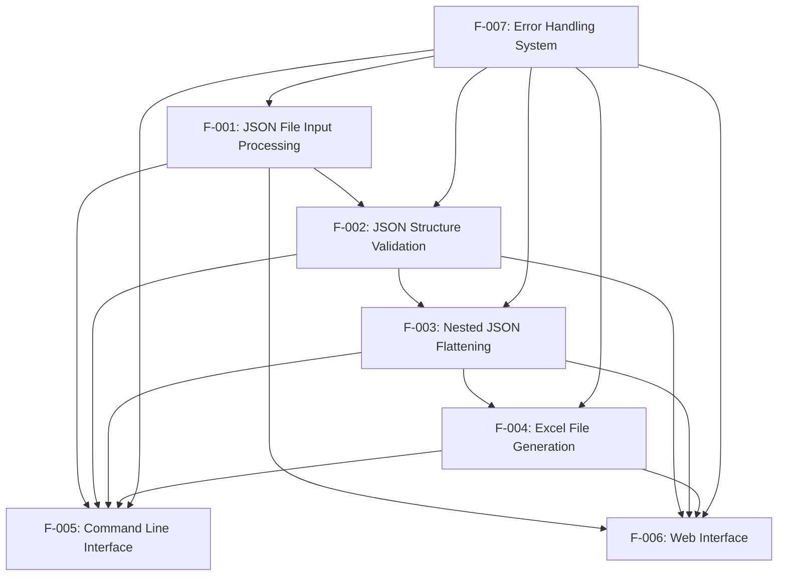
```mermaid
graph TD
    F001[F-001: JSON File Input Processing]
    F002[F-002: JSON Structure Validation]
    F003[F-003: Nested JSON Flattening]
    F004[F-004: Excel File Generation]
    F005[F-005: Command Line Interface]
    F006[F-006: Web Interface]
    F007[F-007: Error Handling System]
    
    F001 --> F002
    F002 --> F003
    F003 --> F004
    F001 --> F005
    F002 --> F005
    F003 --> F005
    F004 --> F005
    F001 --> F006
    F002 --> F006
    F003 --> F006
    F004 --> F006
    F007 --> F001
    F007 --> F002
    F007 --> F003
    F007 --> F004
    F007 --> F005
    F007 --> F006
```

#### 2.3.2 Integration Points

| Feature | Integration Points |
| --- | --- |
| F-001 (JSON File Input) | File system, Error handling system |
| F-002 (JSON Validation) | JSON parser, Error handling system |
| F-003 (JSON Flattening) | Pandas library, Error handling system |
| F-004 (Excel Generation) | File system, Pandas/openpyxl libraries |
| F-005 (CLI) | Command processor, All core features |
| F-006 (Web Interface) | Web server, All core features |
| F-007 (Error Handling) | All features, Logging system |

#### 2.3.3 Shared Components

| Component | Used By Features |
| --- | --- |
| JSON Parser | F-001, F-002 |
| Data Transformer | F-003 |
| File System Access | F-001, F-004 |
| User Interface Layer | F-005, F-006 |
| Error Handler | All features |

### 2.4 IMPLEMENTATION CONSIDERATIONS

#### 2.4.1 Technical Constraints

| Feature | Technical Constraints |
| --- | --- |
| F-001 (JSON File Input) | File size limited to 5MB for standard processing |
| F-003 (JSON Flattening) | Deeply nested structures (>10 levels) may impact performance |
| F-004 (Excel Generation) | Excel row limit of 1,048,576 rows per sheet |
| F-006 (Web Interface) | Browser compatibility requirements |

#### 2.4.2 Performance Requirements

| Feature | Performance Requirements |
| --- | --- |
| F-001 (JSON File Input) | Read files up to 5MB in under 2 seconds |
| F-003 (JSON Flattening) | Process standard nested structures in under 3 seconds |
| F-004 (Excel Generation) | Generate Excel file in under 3 seconds for standard datasets |
| Overall System | Complete end-to-end conversion in under 10 seconds for files up to 5MB |

#### 2.4.3 Scalability Considerations

| Feature | Scalability Considerations |
| --- | --- |
| F-001 (JSON File Input) | Implement streaming for larger files (future enhancement) |
| F-003 (JSON Flattening) | Optimize memory usage for deeply nested structures |
| F-004 (Excel Generation) | Consider chunking for very large datasets |
| F-006 (Web Interface) | Implement request queuing for multiple simultaneous users |

#### 2.4.4 Security Implications

| Feature | Security Implications |
| --- | --- |
| F-001 (JSON File Input) | Validate file paths to prevent directory traversal |
| F-002 (JSON Validation) | Sanitize input to prevent injection attacks |
| F-004 (Excel Generation) | Prevent formula injection in Excel output |
| F-006 (Web Interface) | Implement file upload restrictions and validation |

#### 2.4.5 Maintenance Requirements

| Feature | Maintenance Requirements |
| --- | --- |
| F-003 (JSON Flattening) | Regular updates to handle new JSON structure patterns |
| F-004 (Excel Generation) | Updates for compatibility with new Excel versions |
| F-006 (Web Interface) | Browser compatibility testing and updates |
| F-007 (Error Handling) | Regular review and enhancement of error messages |

### 2.5 TRACEABILITY MATRIX

| Requirement ID | Feature ID | Priority | Status | Dependent Requirements |
| --- | --- | --- | --- | --- |
| F-001-RQ-001 | F-001 | Must-Have | Approved | None |
| F-002-RQ-001 | F-002 | Must-Have | Approved | F-001-RQ-001 |
| F-003-RQ-001 | F-003 | Must-Have | Approved | F-002-RQ-001 |
| F-003-RQ-002 | F-003 | Must-Have | Approved | F-002-RQ-001 |
| F-004-RQ-001 | F-004 | Must-Have | Approved | F-003-RQ-001, F-003-RQ-002 |
| F-005-RQ-001 | F-005 | Must-Have | Approved | F-001-RQ-001, F-004-RQ-001 |

## 3. TECHNOLOGY STACK

### 3.1 PROGRAMMING LANGUAGES

| Language | Version | Purpose | Justification |
| --- | --- | --- | --- |
| Python | 3.9+ | Core application development | Python is ideal for data processing tasks with excellent JSON and Excel handling libraries. Its readability and extensive data manipulation ecosystem make it perfect for this conversion tool. |

### 3.2 FRAMEWORKS & LIBRARIES

#### 3.2.1 Core Libraries

| Library | Version | Purpose | Justification |
| --- | --- | --- | --- |
| Pandas | 1.5.0+ | Data manipulation and transformation | Provides robust JSON normalization capabilities through `json_normalize()` function, essential for flattening nested JSON structures into tabular format. |
| openpyxl | 3.1.0+ | Excel file generation | Native Python library for creating and manipulating Excel XLSX files with full formatting control. |
| json | Built-in | JSON parsing and validation | Python's built-in JSON module provides efficient parsing and validation of JSON data structures. |

#### 3.2.2 Optional Libraries

| Library | Version | Purpose | Justification |
| --- | --- | --- | --- |
| Flask | 2.3.0+ | Web interface (optional) | Lightweight web framework for creating the optional browser-based interface, chosen for its simplicity and ease of integration. |
| argparse | Built-in | Command-line interface | Python's built-in argument parsing library for creating a robust CLI with proper help documentation. |
| pytest | 7.3.0+ | Testing framework | Industry-standard testing framework for Python to ensure code quality and reliability. |

### 3.3 DATABASES & STORAGE

This application does not require a persistent database as it processes files directly. All data is handled in-memory during the conversion process.

| Storage Type | Purpose | Justification |
| --- | --- | --- |
| Local File System | Input/Output file storage | The application reads JSON files from and writes Excel files to the local filesystem, requiring appropriate read/write permissions. |
| In-Memory Processing | Data transformation | All data processing occurs in-memory using Pandas DataFrames, optimizing for performance while avoiding unnecessary persistence. |

### 3.4 THIRD-PARTY SERVICES

The core functionality of this tool does not require external services or APIs. It operates as a standalone utility with all processing done locally.

### 3.5 DEVELOPMENT & DEPLOYMENT

#### 3.5.1 Development Tools

| Tool | Version | Purpose | Justification |
| --- | --- | --- | --- |
| Visual Studio Code | Latest | Development environment | Cross-platform IDE with excellent Python support and debugging capabilities. |
| Git | Latest | Version control | Industry-standard version control system for tracking changes and collaboration. |
| Black | 23.1.0+ | Code formatting | Ensures consistent code style across the codebase. |
| Flake8 | 6.0.0+ | Code linting | Identifies potential errors and enforces coding standards. |

#### 3.5.2 Build & Packaging

| Tool | Version | Purpose | Justification |
| --- | --- | --- | --- |
| setuptools | 67.0.0+ | Package creation | Standard Python library for creating distributable packages. |
| pip | Latest | Package installation | Standard Python package manager for dependency management. |
| PyInstaller | 5.9.0+ | Executable creation | Creates standalone executables for non-technical users (optional). |

#### 3.5.3 Deployment Options

| Deployment Method | Purpose | Justification |
| --- | --- | --- |
| Python Package (PyPI) | Distribution as library | Allows the tool to be installed via pip for integration into other Python projects. |
| Standalone Executable | Distribution to end-users | Creates a single executable file for non-technical users (Windows/Mac/Linux). |
| Docker Container | Containerized deployment | Optional containerization for consistent execution environment and easier integration into existing workflows. |

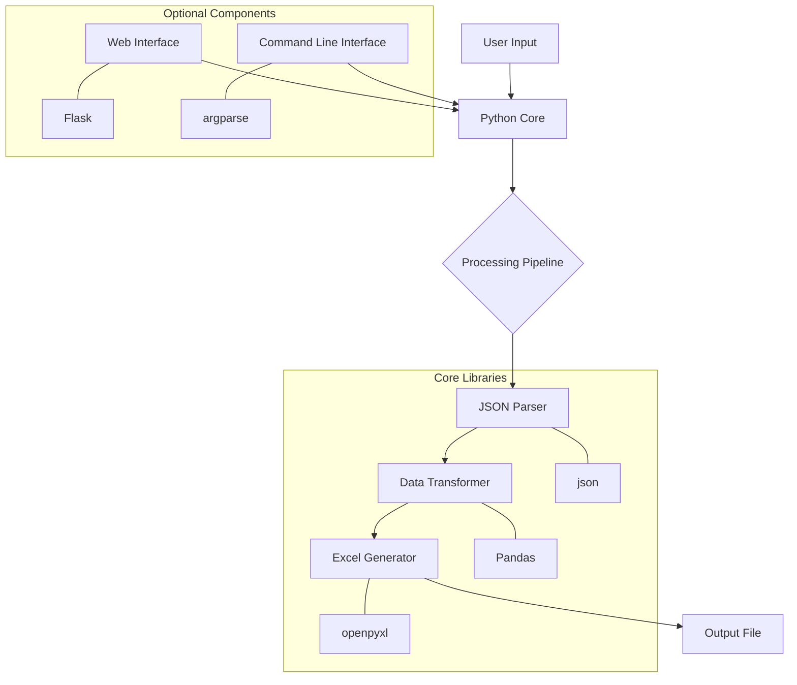
```mermaid
graph TD
    A[User Input] --> B[Python Core]
    B --> C{Processing Pipeline}
    C --> D[JSON Parser]
    D --> E[Data Transformer]
    E --> F[Excel Generator]
    F --> G[Output File]
    
    H[Command Line Interface] --> B
    I[Web Interface] --> B
    
    subgraph "Core Libraries"
    D --- J[json]
    E --- K[Pandas]
    F --- L[openpyxl]
    end
    
    subgraph "Optional Components"
    I --- M[Flask]
    H --- N[argparse]
    end
```

### 3.6 TECHNOLOGY CONSTRAINTS & CONSIDERATIONS

| Constraint | Impact | Mitigation |
| --- | --- | --- |
| Memory Usage | Large JSON files may consume significant memory during processing | Implement chunked processing for files exceeding memory thresholds |
| Excel Row Limit | Excel has a 1,048,576 row limit | Add validation to check output size and warn users if approaching limits |
| Python Version Compatibility | Ensuring compatibility across Python versions | Target Python 3.9+ and use compatibility libraries where needed |
| Performance | Processing time for complex nested structures | Optimize flattening algorithms and provide progress indicators for large files |

## 4. PROCESS FLOWCHART

### 4.1 SYSTEM WORKFLOWS

#### 4.1.1 Core Business Processes

##### End-to-End JSON to Excel Conversion Process

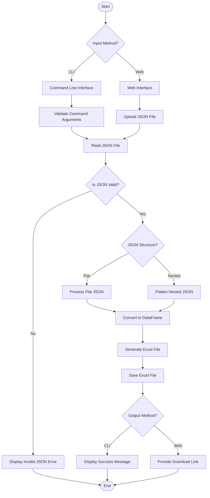
```mermaid
flowchart TD
    Start([Start]) --> InputMethod{Input Method?}
    InputMethod -->|CLI| CLI[Command Line Interface]
    InputMethod -->|Web| Web[Web Interface]
    
    CLI --> ValidateArgs[Validate Command Arguments]
    ValidateArgs --> ReadJSONFile[Read JSON File]
    
    Web --> UploadFile[Upload JSON File]
    UploadFile --> ReadJSONFile
    
    ReadJSONFile --> ValidateJSON{Is JSON Valid?}
    ValidateJSON -->|No| ErrorInvalidJSON[Display Invalid JSON Error]
    ErrorInvalidJSON --> End([End])
    
    ValidateJSON -->|Yes| CheckJSONStructure{JSON Structure?}
    CheckJSONStructure -->|Flat| ProcessFlatJSON[Process Flat JSON]
    CheckJSONStructure -->|Nested| ProcessNestedJSON[Flatten Nested JSON]
    
    ProcessFlatJSON --> ConvertToDataFrame[Convert to DataFrame]
    ProcessNestedJSON --> ConvertToDataFrame
    
    ConvertToDataFrame --> GenerateExcel[Generate Excel File]
    GenerateExcel --> SaveExcel[Save Excel File]
    
    SaveExcel --> OutputMethod{Output Method?}
    OutputMethod -->|CLI| DisplaySuccess[Display Success Message]
    OutputMethod -->|Web| ProvideDownload[Provide Download Link]
    
    DisplaySuccess --> End
    ProvideDownload --> End
```

##### User Interaction Flow

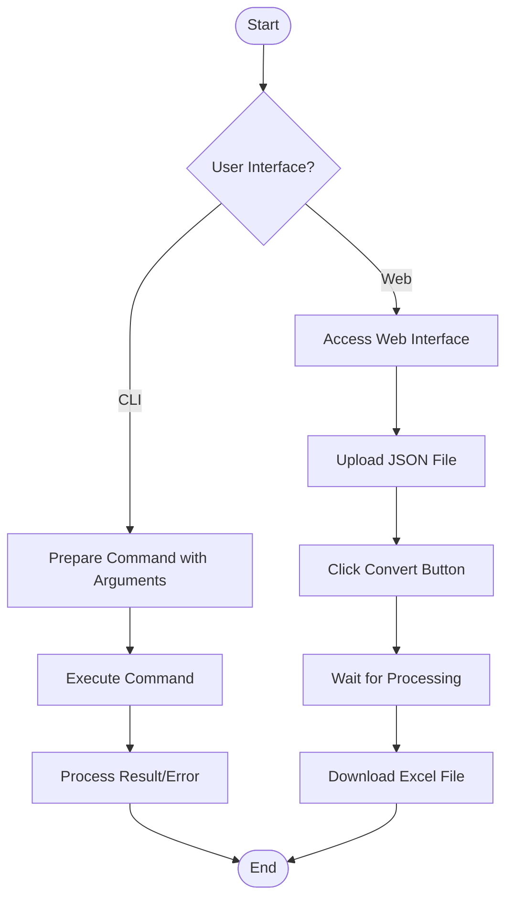
```mermaid
flowchart TD
    Start([Start]) --> UserChoice{User Interface?}
    
    UserChoice -->|CLI| PrepareCommand[Prepare Command with Arguments]
    PrepareCommand --> ExecuteCommand[Execute Command]
    ExecuteCommand --> ProcessResult[Process Result/Error]
    
    UserChoice -->|Web| AccessWebUI[Access Web Interface]
    AccessWebUI --> UploadJSON[Upload JSON File]
    UploadJSON --> ClickConvert[Click Convert Button]
    ClickConvert --> WaitProcessing[Wait for Processing]
    WaitProcessing --> DownloadResult[Download Excel File]
    
    ProcessResult --> End([End])
    DownloadResult --> End
```

##### Error Handling Paths

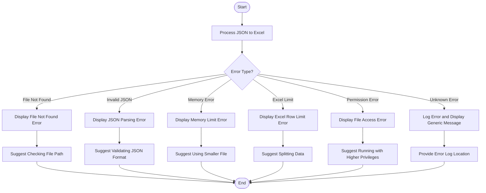
```mermaid
flowchart TD
    Start([Start]) --> Process[Process JSON to Excel]
    
    Process --> Error{Error Type?}
    
    Error -->|File Not Found| FileNotFoundError[Display File Not Found Error]
    Error -->|Invalid JSON| InvalidJSONError[Display JSON Parsing Error]
    Error -->|Memory Error| MemoryError[Display Memory Limit Error]
    Error -->|Excel Limit| ExcelLimitError[Display Excel Row Limit Error]
    Error -->|Permission Error| PermissionError[Display File Access Error]
    Error -->|Unknown Error| UnknownError[Log Error and Display Generic Message]
    
    FileNotFoundError --> Suggestion1[Suggest Checking File Path]
    InvalidJSONError --> Suggestion2[Suggest Validating JSON Format]
    MemoryError --> Suggestion3[Suggest Using Smaller File]
    ExcelLimitError --> Suggestion4[Suggest Splitting Data]
    PermissionError --> Suggestion5[Suggest Running with Higher Privileges]
    UnknownError --> Suggestion6[Provide Error Log Location]
    
    Suggestion1 --> End([End])
    Suggestion2 --> End
    Suggestion3 --> End
    Suggestion4 --> End
    Suggestion5 --> End
    Suggestion6 --> End
```

#### 4.1.2 Integration Workflows

##### Data Flow Between Components

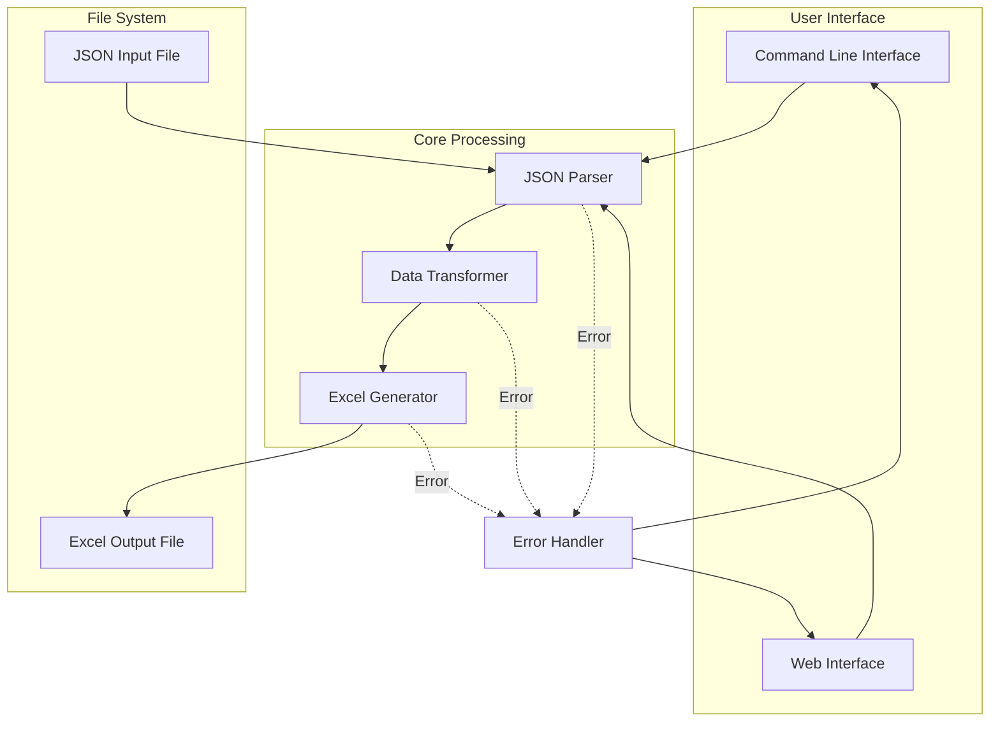
```mermaid
flowchart TD
    subgraph User Interface
        CLI[Command Line Interface]
        Web[Web Interface]
    end
    
    subgraph Core Processing
        JSONParser[JSON Parser]
        DataTransformer[Data Transformer]
        ExcelGenerator[Excel Generator]
    end
    
    subgraph File System
        InputFile[JSON Input File]
        OutputFile[Excel Output File]
    end
    
    CLI --> JSONParser
    Web --> JSONParser
    
    InputFile --> JSONParser
    JSONParser --> DataTransformer
    DataTransformer --> ExcelGenerator
    ExcelGenerator --> OutputFile
    
    JSONParser -.->|Error| ErrorHandler[Error Handler]
    DataTransformer -.->|Error| ErrorHandler
    ExcelGenerator -.->|Error| ErrorHandler
    
    ErrorHandler --> CLI
    ErrorHandler --> Web
```

##### Batch Processing Sequence

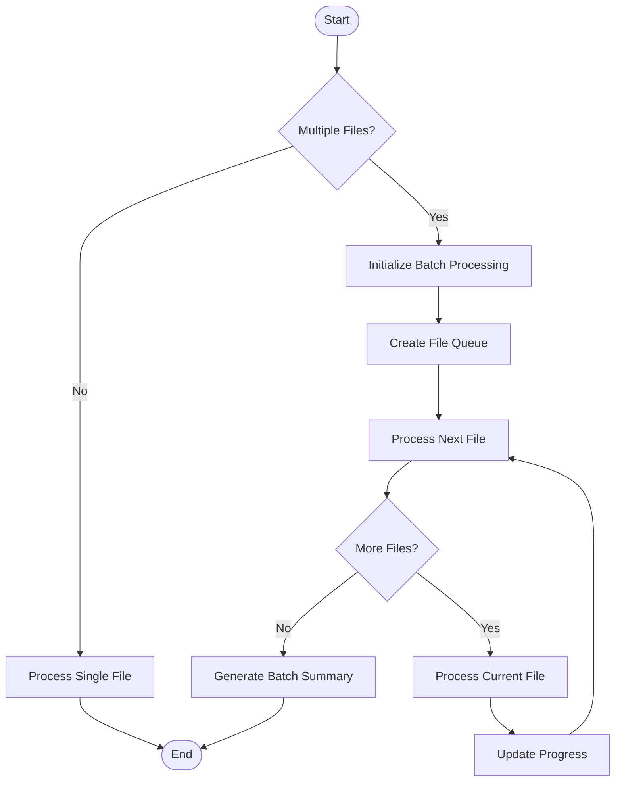
```mermaid
flowchart TD
    Start([Start]) --> InputCheck{Multiple Files?}
    
    InputCheck -->|No| SingleProcess[Process Single File]
    InputCheck -->|Yes| BatchProcess[Initialize Batch Processing]
    
    BatchProcess --> FileQueue[Create File Queue]
    FileQueue --> ProcessNext[Process Next File]
    
    ProcessNext --> FileAvailable{More Files?}
    FileAvailable -->|Yes| ProcessFile[Process Current File]
    FileAvailable -->|No| GenerateSummary[Generate Batch Summary]
    
    ProcessFile --> UpdateProgress[Update Progress]
    UpdateProgress --> ProcessNext
    
    SingleProcess --> End([End])
    GenerateSummary --> End
```

### 4.2 FLOWCHART REQUIREMENTS

#### 4.2.1 JSON File Processing Workflow

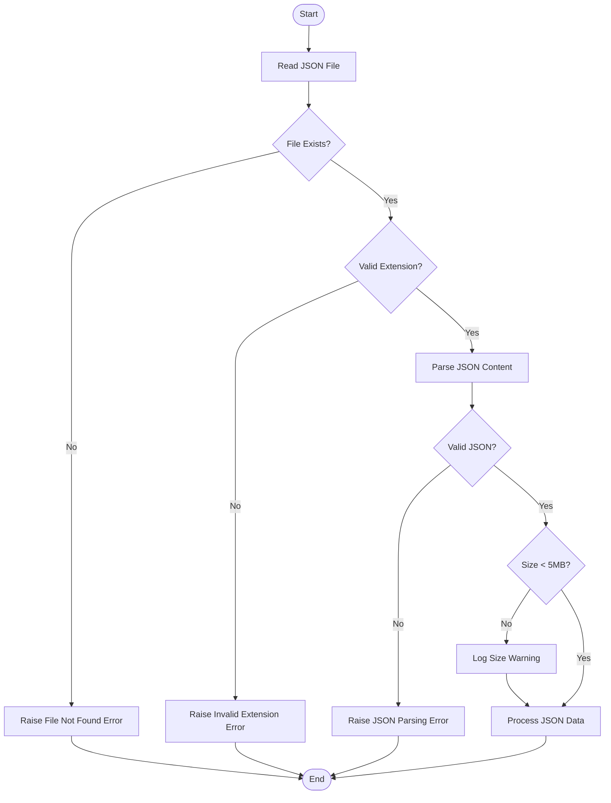
```mermaid
flowchart TD
    Start([Start]) --> ReadFile[Read JSON File]
    ReadFile --> FileExists{File Exists?}
    
    FileExists -->|No| FileNotFoundError[Raise File Not Found Error]
    FileExists -->|Yes| ValidateExtension{Valid Extension?}
    
    ValidateExtension -->|No| InvalidExtensionError[Raise Invalid Extension Error]
    ValidateExtension -->|Yes| ParseJSON[Parse JSON Content]
    
    ParseJSON --> ValidJSON{Valid JSON?}
    ValidJSON -->|No| InvalidJSONError[Raise JSON Parsing Error]
    ValidJSON -->|Yes| CheckSize{Size < 5MB?}
    
    CheckSize -->|No| SizeWarning[Log Size Warning]
    CheckSize -->|Yes| ProcessJSON[Process JSON Data]
    SizeWarning --> ProcessJSON
    
    ProcessJSON --> End([End])
    FileNotFoundError --> End
    InvalidExtensionError --> End
    InvalidJSONError --> End
```

#### 4.2.2 Nested JSON Flattening Workflow

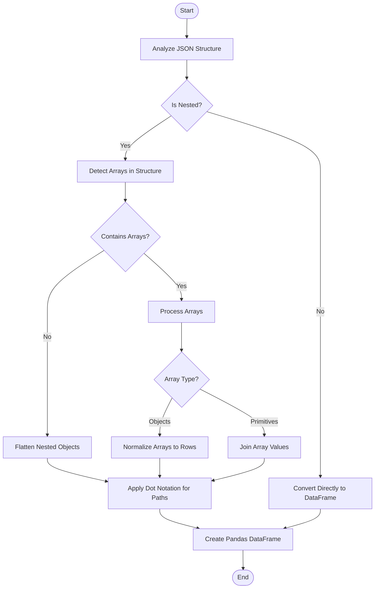
```mermaid
flowchart TD
    Start([Start]) --> AnalyzeStructure[Analyze JSON Structure]
    AnalyzeStructure --> IsNested{Is Nested?}
    
    IsNested -->|No| ConvertDirectly[Convert Directly to DataFrame]
    IsNested -->|Yes| DetectArrays[Detect Arrays in Structure]
    
    DetectArrays --> ContainsArrays{Contains Arrays?}
    ContainsArrays -->|No| FlattenObjects[Flatten Nested Objects]
    ContainsArrays -->|Yes| ProcessArrays[Process Arrays]
    
    ProcessArrays --> ArrayType{Array Type?}
    ArrayType -->|Objects| NormalizeArrays[Normalize Arrays to Rows]
    ArrayType -->|Primitives| JoinArrayValues[Join Array Values]
    
    FlattenObjects --> ApplyDotNotation[Apply Dot Notation for Paths]
    NormalizeArrays --> ApplyDotNotation
    JoinArrayValues --> ApplyDotNotation
    
    ApplyDotNotation --> CreateDataFrame[Create Pandas DataFrame]
    ConvertDirectly --> CreateDataFrame
    
    CreateDataFrame --> End([End])
```

#### 4.2.3 Excel Generation Workflow

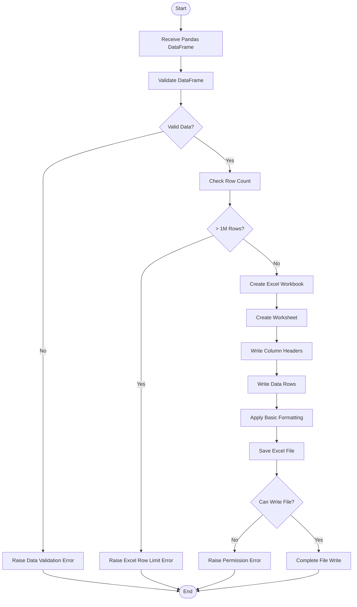
```mermaid
flowchart TD
    Start([Start]) --> ReceiveDataFrame[Receive Pandas DataFrame]
    ReceiveDataFrame --> ValidateData[Validate DataFrame]
    
    ValidateData --> IsValid{Valid Data?}
    IsValid -->|No| DataValidationError[Raise Data Validation Error]
    IsValid -->|Yes| CheckRowCount[Check Row Count]
    
    CheckRowCount --> ExceedsLimit{> 1M Rows?}
    ExceedsLimit -->|Yes| RowLimitError[Raise Excel Row Limit Error]
    ExceedsLimit -->|No| CreateWorkbook[Create Excel Workbook]
    
    CreateWorkbook --> CreateSheet[Create Worksheet]
    CreateSheet --> WriteHeaders[Write Column Headers]
    WriteHeaders --> WriteData[Write Data Rows]
    
    WriteData --> ApplyFormatting[Apply Basic Formatting]
    ApplyFormatting --> SaveFile[Save Excel File]
    
    SaveFile --> FileWritable{Can Write File?}
    FileWritable -->|No| PermissionError[Raise Permission Error]
    FileWritable -->|Yes| CompleteWrite[Complete File Write]
    
    CompleteWrite --> End([End])
    DataValidationError --> End
    RowLimitError --> End
    PermissionError --> End
```

#### 4.2.4 Command Line Interface Workflow

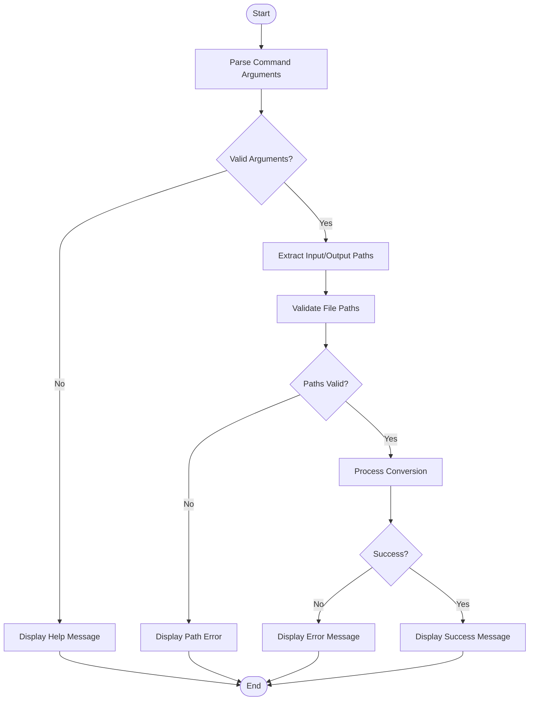
```mermaid
flowchart TD
    Start([Start]) --> ParseArgs[Parse Command Arguments]
    ParseArgs --> ValidArgs{Valid Arguments?}
    
    ValidArgs -->|No| DisplayHelp[Display Help Message]
    ValidArgs -->|Yes| ExtractPaths[Extract Input/Output Paths]
    
    ExtractPaths --> ValidatePaths[Validate File Paths]
    ValidatePaths --> PathsValid{Paths Valid?}
    
    PathsValid -->|No| PathError[Display Path Error]
    PathsValid -->|Yes| ProcessConversion[Process Conversion]
    
    ProcessConversion --> ConversionSuccess{Success?}
    ConversionSuccess -->|No| DisplayError[Display Error Message]
    ConversionSuccess -->|Yes| DisplaySuccess[Display Success Message]
    
    DisplayHelp --> End([End])
    PathError --> End
    DisplayError --> End
    DisplaySuccess --> End
```

#### 4.2.5 Web Interface Workflow

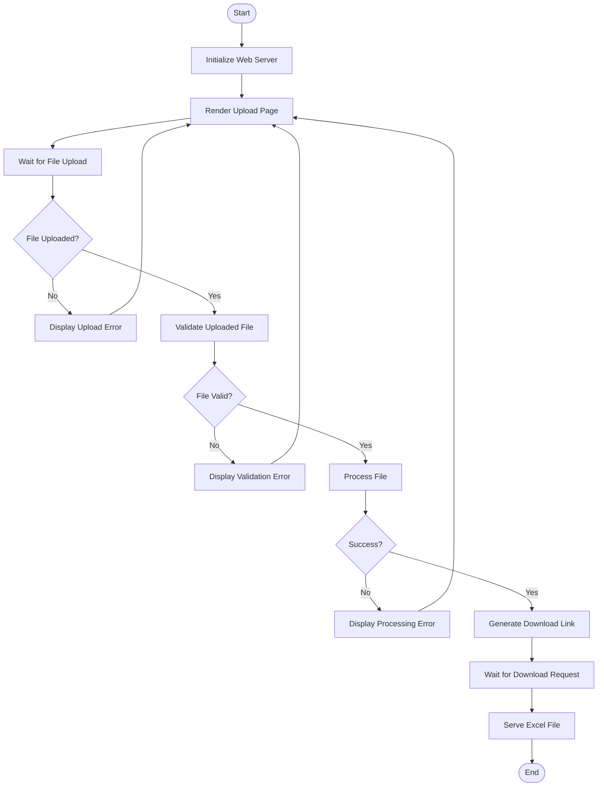
```mermaid
flowchart TD
    Start([Start]) --> InitializeServer[Initialize Web Server]
    InitializeServer --> RenderUploadPage[Render Upload Page]
    
    RenderUploadPage --> WaitForUpload[Wait for File Upload]
    WaitForUpload --> FileUploaded{File Uploaded?}
    
    FileUploaded -->|No| DisplayUploadError[Display Upload Error]
    FileUploaded -->|Yes| ValidateFile[Validate Uploaded File]
    
    ValidateFile --> FileValid{File Valid?}
    FileValid -->|No| DisplayValidationError[Display Validation Error]
    FileValid -->|Yes| ProcessFile[Process File]
    
    ProcessFile --> ProcessingSuccess{Success?}
    ProcessingSuccess -->|No| DisplayProcessingError[Display Processing Error]
    ProcessingSuccess -->|Yes| GenerateDownloadLink[Generate Download Link]
    
    GenerateDownloadLink --> WaitForDownload[Wait for Download Request]
    WaitForDownload --> ServeFile[Serve Excel File]
    
    DisplayUploadError --> RenderUploadPage
    DisplayValidationError --> RenderUploadPage
    DisplayProcessingError --> RenderUploadPage
    ServeFile --> End([End])
```

### 4.3 VALIDATION RULES

#### 4.3.1 Business Rules and Validation Requirements

| Process Step | Validation Rule | Error Handling |
| --- | --- | --- |
| JSON File Input | File must exist and be readable | Display file not found error |
| JSON File Input | File must have .json extension | Display invalid file type error |
| JSON Parsing | Content must be valid JSON format | Display JSON parsing error with line number |
| JSON Structure | Maximum nesting depth of 10 levels | Display excessive nesting warning |
| JSON Size | File size should not exceed 5MB | Display performance warning for large files |
| Excel Generation | Row count must not exceed Excel limit (1,048,576) | Display row limit error and suggest splitting |
| Excel Generation | Column count must not exceed Excel limit (16,384) | Display column limit error and suggest restructuring |
| File Output | Output directory must be writable | Display permission error |
| File Output | Output file must not be open in another application | Display file access error |

#### 4.3.2 Authorization Checkpoints

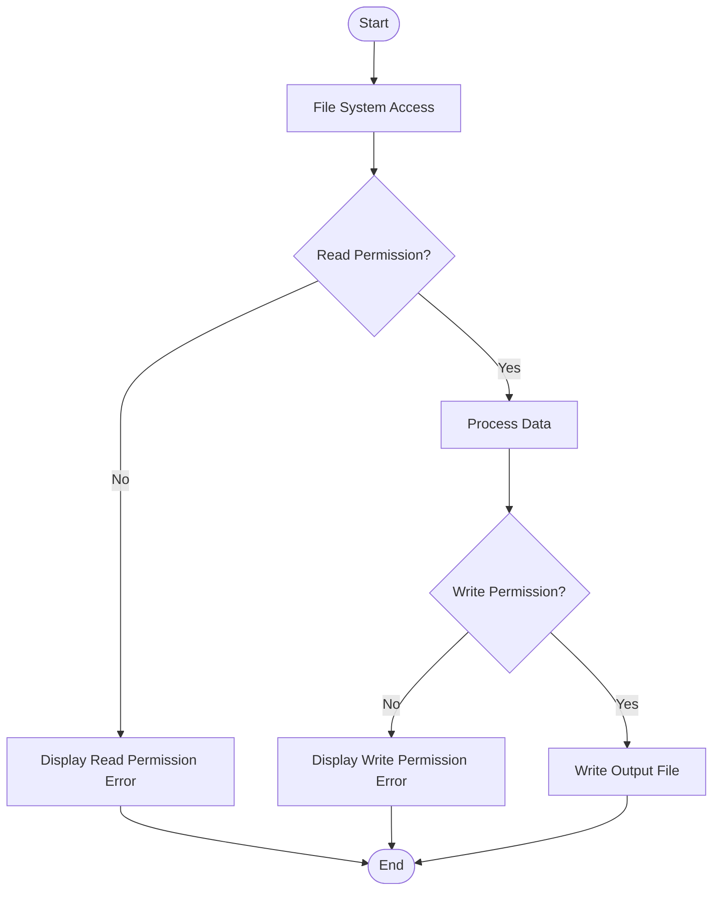
```mermaid
flowchart TD
    Start([Start]) --> FileAccess[File System Access]
    
    FileAccess --> ReadPermission{Read Permission?}
    ReadPermission -->|No| ReadError[Display Read Permission Error]
    ReadPermission -->|Yes| ProcessData[Process Data]
    
    ProcessData --> WritePermission{Write Permission?}
    WritePermission -->|No| WriteError[Display Write Permission Error]
    WritePermission -->|Yes| WriteOutput[Write Output File]
    
    WriteOutput --> End([End])
    ReadError --> End
    WriteError --> End
```

### 4.4 TECHNICAL IMPLEMENTATION

#### 4.4.1 State Management

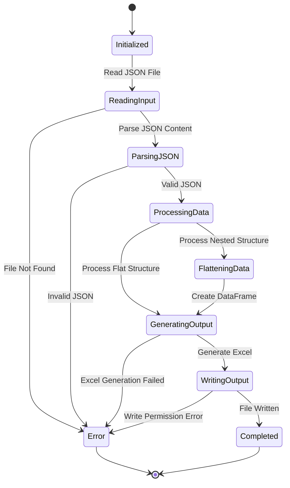
```mermaid
stateDiagram-v2
    [*] --> Initialized
    
    Initialized --> ReadingInput: Read JSON File
    ReadingInput --> ParsingJSON: Parse JSON Content
    ReadingInput --> Error: File Not Found
    
    ParsingJSON --> ProcessingData: Valid JSON
    ParsingJSON --> Error: Invalid JSON
    
    ProcessingData --> FlatteningData: Process Nested Structure
    ProcessingData --> GeneratingOutput: Process Flat Structure
    
    FlatteningData --> GeneratingOutput: Create DataFrame
    
    GeneratingOutput --> WritingOutput: Generate Excel
    GeneratingOutput --> Error: Excel Generation Failed
    
    WritingOutput --> Completed: File Written
    WritingOutput --> Error: Write Permission Error
    
    Error --> [*]
    Completed --> [*]
```

#### 4.4.2 Data Persistence Points

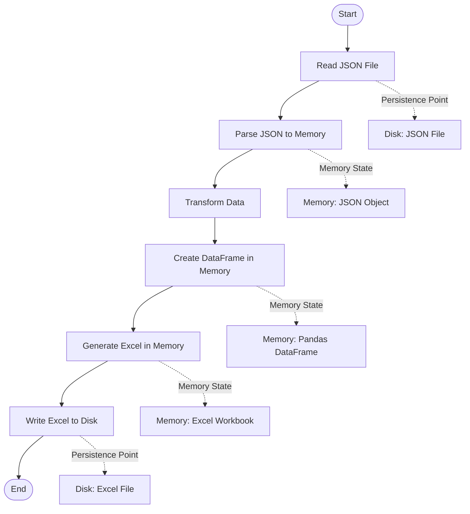
```mermaid
flowchart TD
    Start([Start]) --> ReadJSON[Read JSON File]
    ReadJSON --> ParseJSON[Parse JSON to Memory]
    
    ParseJSON --> TransformData[Transform Data]
    TransformData --> CreateDataFrame[Create DataFrame in Memory]
    
    CreateDataFrame --> GenerateExcel[Generate Excel in Memory]
    GenerateExcel --> WriteFile[Write Excel to Disk]
    
    WriteFile --> End([End])
    
    ReadJSON -.->|Persistence Point| P1[Disk: JSON File]
    WriteFile -.->|Persistence Point| P2[Disk: Excel File]
    
    ParseJSON -.->|Memory State| M1[Memory: JSON Object]
    CreateDataFrame -.->|Memory State| M2[Memory: Pandas DataFrame]
    GenerateExcel -.->|Memory State| M3[Memory: Excel Workbook]
```

#### 4.4.3 Error Handling and Recovery

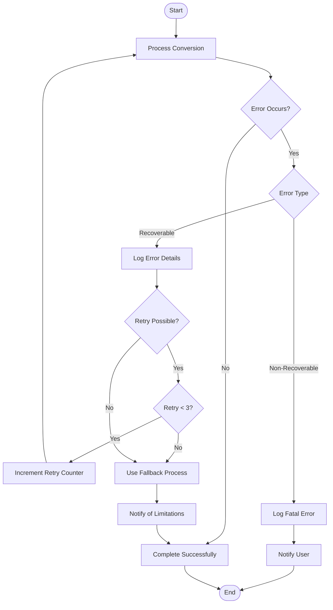
```mermaid
flowchart TD
    Start([Start]) --> Process[Process Conversion]
    
    Process --> Error{Error Occurs?}
    Error -->|No| Complete[Complete Successfully]
    
    Error -->|Yes| ErrorType{Error Type}
    
    ErrorType -->|Recoverable| LogError[Log Error Details]
    LogError --> RetryPossible{Retry Possible?}
    
    RetryPossible -->|Yes| RetryCount{Retry < 3?}
    RetryCount -->|Yes| IncrementRetry[Increment Retry Counter]
    IncrementRetry --> Process
    
    RetryCount -->|No| FallbackProcess[Use Fallback Process]
    RetryPossible -->|No| FallbackProcess
    
    ErrorType -->|Non-Recoverable| LogFatalError[Log Fatal Error]
    LogFatalError --> NotifyUser[Notify User]
    
    FallbackProcess --> NotifyLimitations[Notify of Limitations]
    NotifyLimitations --> Complete
    
    NotifyUser --> End([End])
    Complete --> End
```

#### 4.4.4 Retry Mechanism

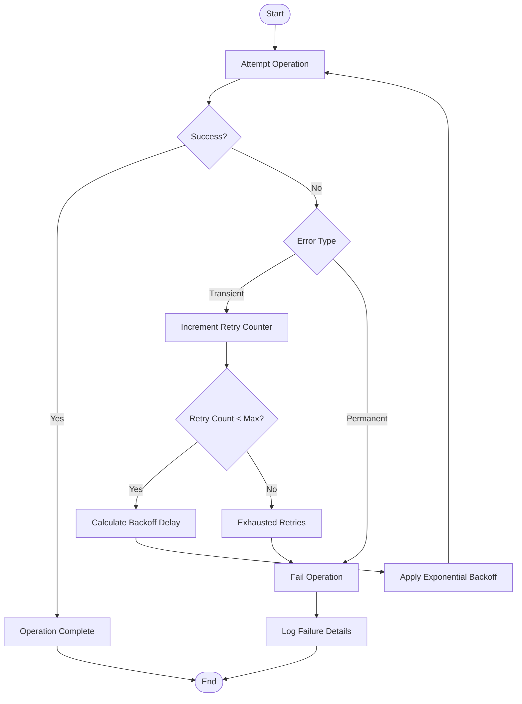
```mermaid
flowchart TD
    Start([Start]) --> AttemptOperation[Attempt Operation]
    
    AttemptOperation --> Success{Success?}
    Success -->|Yes| Complete[Operation Complete]
    
    Success -->|No| ErrorType{Error Type}
    ErrorType -->|Transient| IncrementCounter[Increment Retry Counter]
    ErrorType -->|Permanent| FailOperation[Fail Operation]
    
    IncrementCounter --> RetryCount{Retry Count < Max?}
    RetryCount -->|Yes| CalculateDelay[Calculate Backoff Delay]
    RetryCount -->|No| ExhaustedRetries[Exhausted Retries]
    
    CalculateDelay --> ApplyDelay[Apply Exponential Backoff]
    ApplyDelay --> AttemptOperation
    
    ExhaustedRetries --> FailOperation
    FailOperation --> LogFailure[Log Failure Details]
    
    Complete --> End([End])
    LogFailure --> End
```

### 4.5 INTEGRATION SEQUENCE DIAGRAMS

#### 4.5.1 CLI to Core Processing Sequence

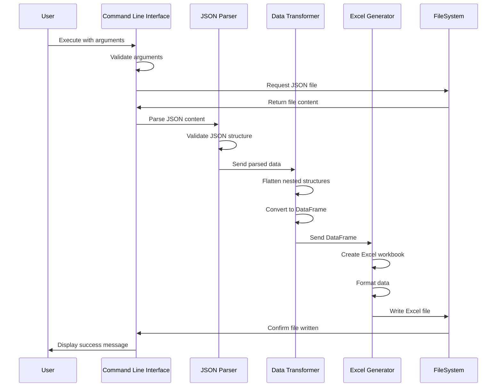
```mermaid
sequenceDiagram
    participant User
    participant CLI as Command Line Interface
    participant Parser as JSON Parser
    participant Transformer as Data Transformer
    participant Generator as Excel Generator
    participant FileSystem
    
    User->>CLI: Execute with arguments
    CLI->>CLI: Validate arguments
    CLI->>FileSystem: Request JSON file
    FileSystem->>CLI: Return file content
    
    CLI->>Parser: Parse JSON content
    Parser->>Parser: Validate JSON structure
    Parser->>Transformer: Send parsed data
    
    Transformer->>Transformer: Flatten nested structures
    Transformer->>Transformer: Convert to DataFrame
    Transformer->>Generator: Send DataFrame
    
    Generator->>Generator: Create Excel workbook
    Generator->>Generator: Format data
    Generator->>FileSystem: Write Excel file
    
    FileSystem->>CLI: Confirm file written
    CLI->>User: Display success message
```

#### 4.5.2 Web Interface to Core Processing Sequence

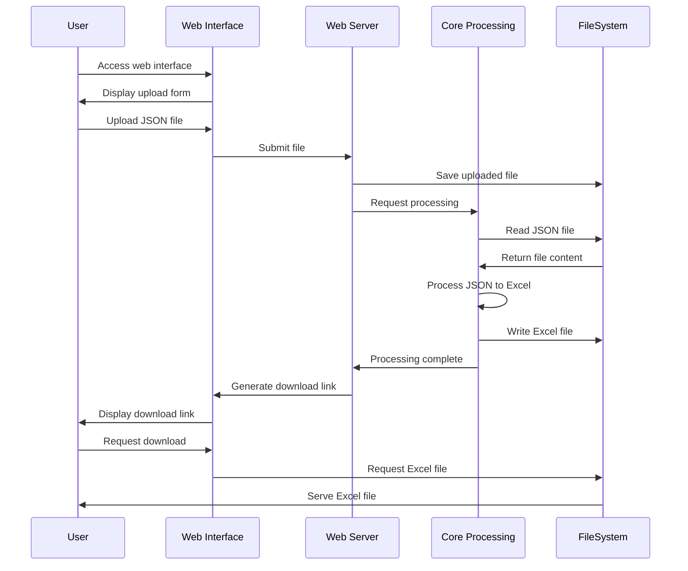
```mermaid
sequenceDiagram
    participant User
    participant WebUI as Web Interface
    participant Server as Web Server
    participant Core as Core Processing
    participant FileSystem
    
    User->>WebUI: Access web interface
    WebUI->>User: Display upload form
    User->>WebUI: Upload JSON file
    WebUI->>Server: Submit file
    
    Server->>FileSystem: Save uploaded file
    Server->>Core: Request processing
    
    Core->>FileSystem: Read JSON file
    FileSystem->>Core: Return file content
    Core->>Core: Process JSON to Excel
    Core->>FileSystem: Write Excel file
    
    Core->>Server: Processing complete
    Server->>WebUI: Generate download link
    WebUI->>User: Display download link
    User->>WebUI: Request download
    WebUI->>FileSystem: Request Excel file
    FileSystem->>User: Serve Excel file
```

#### 4.5.3 Error Notification Flow

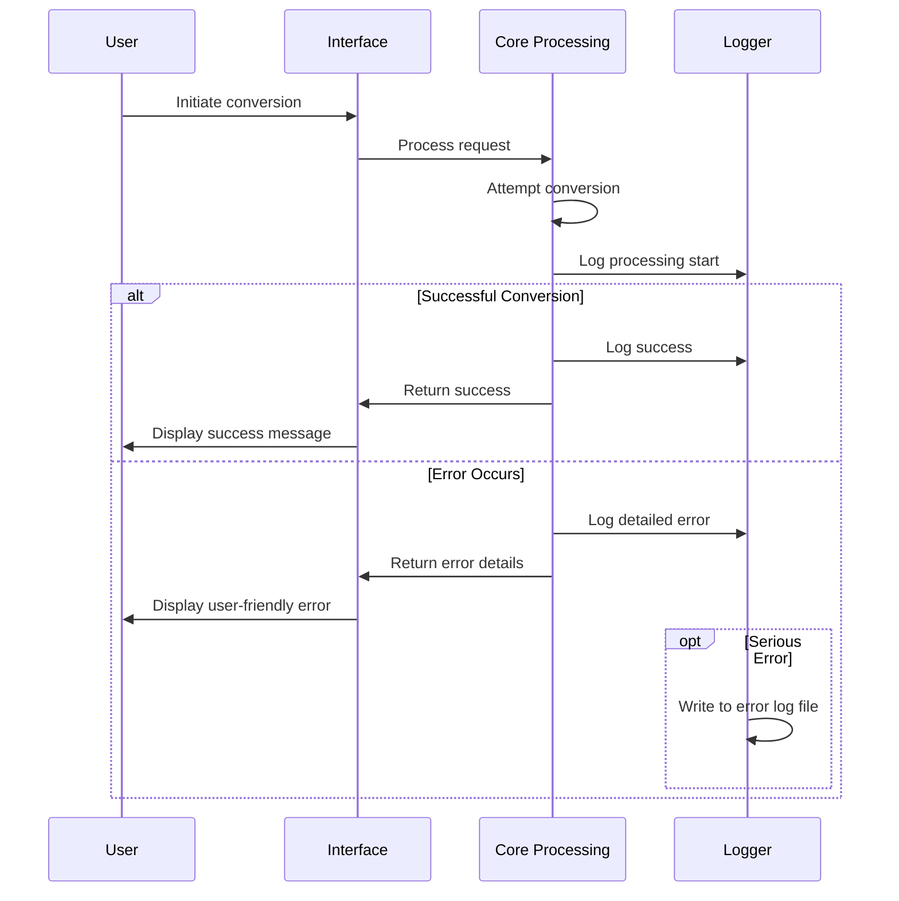
```mermaid
sequenceDiagram
    participant User
    participant Interface
    participant Core as Core Processing
    participant Logger
    
    User->>Interface: Initiate conversion
    Interface->>Core: Process request
    
    Core->>Core: Attempt conversion
    Core->>Logger: Log processing start
    
    alt Successful Conversion
        Core->>Logger: Log success
        Core->>Interface: Return success
        Interface->>User: Display success message
    else Error Occurs
        Core->>Logger: Log detailed error
        Core->>Interface: Return error details
        Interface->>User: Display user-friendly error
        
        opt Serious Error
            Logger->>Logger: Write to error log file
        end
    end
```

### 4.6 TIMING AND SLA CONSIDERATIONS

#### 4.6.1 Performance Timing Diagram

```mermaid
gantt
    title JSON to Excel Conversion Process Timing
    dateFormat s
    axisFormat %S
    
    section Small File (<100KB)
    JSON Parsing           :a1, 0, 0.2s
    Data Transformation    :a2, after a1, 0.3s
    Excel Generation       :a3, after a2, 0.5s
    File Writing           :a4, after a3, 0.2s
    
    section Medium File (1MB)
    JSON Parsing           :b1, 0, 0.5s
    Data Transformation    :b2, after b1, 1s
    Excel Generation       :b3, after b2, 1.5s
    File Writing           :b4, after b3, 0.5s
    
    section Large File (5MB)
    JSON Parsing           :c1, 0, 1s
    Data Transformation    :c2, after c1, 3s
    Excel Generation       :c3, after c2, 4s
    File Writing           :c4, after c3, 1s
```

#### 4.6.2 SLA Requirements Table

| Process | File Size | Maximum Processing Time | Retry Attempts | Timeout |
| --- | --- | --- | --- | --- |
| JSON Parsing | Small (<100KB) | 0.5 seconds | 1 | 2 seconds |
| JSON Parsing | Medium (1MB) | 1 second | 2 | 5 seconds |
| JSON Parsing | Large (5MB) | 3 seconds | 3 | 10 seconds |
| Data Transformation | Small (<100KB) | 1 second | 1 | 3 seconds |
| Data Transformation | Medium (1MB) | 3 seconds | 2 | 10 seconds |
| Data Transformation | Large (5MB) | 10 seconds | 3 | 30 seconds |
| Excel Generation | Small (<100KB) | 1 second | 1 | 3 seconds |
| Excel Generation | Medium (1MB) | 3 seconds | 2 | 10 seconds |
| Excel Generation | Large (5MB) | 10 seconds | 3 | 30 seconds |
| End-to-End Process | Small (<100KB) | 3 seconds | N/A | 10 seconds |
| End-to-End Process | Medium (1MB) | 10 seconds | N/A | 30 seconds |
| End-to-End Process | Large (5MB) | 30 seconds | N/A | 90 seconds |

## 5. SYSTEM ARCHITECTURE

### 5.1 HIGH-LEVEL ARCHITECTURE

#### 5.1.1 System Overview

The JSON to Excel Conversion Tool follows a **pipeline architecture** with a clear separation of concerns between components. This architecture was chosen for its simplicity, maintainability, and the natural flow of data transformation from JSON input to Excel output.

- **Architectural Style**: The system uses a modular pipeline architecture where data flows through distinct processing stages. This approach allows for clear separation of concerns and makes the system easier to test, maintain, and extend.

- **Key Architectural Principles**:
  - Single Responsibility Principle: Each component handles one specific aspect of the conversion process
  - Loose Coupling: Components interact through well-defined interfaces
  - Data Transformation Pipeline: Clear sequential flow from input to output
  - Error Propagation: Errors are captured and propagated through the pipeline

- **System Boundaries**:
  - Input Boundary: JSON files from local filesystem
  - Output Boundary: Excel files written to local filesystem
  - User Interface Boundaries: Command-line interface and optional web interface

#### 5.1.2 Core Components Table

| Component Name | Primary Responsibility | Key Dependencies | Critical Considerations |
| --- | --- | --- | --- |
| Input Handler | Reads and validates JSON files | Python JSON library | File access permissions, error handling for invalid files |
| JSON Parser | Parses JSON content into memory | Input Handler | Memory usage for large files, validation of JSON structure |
| Data Transformer | Flattens nested JSON structures | Pandas library | Handling complex nested structures, array normalization |
| Excel Generator | Creates formatted Excel output | Pandas, openpyxl | Excel row/column limits, formatting requirements |
| User Interface | Provides user interaction methods | All core components | Usability, error reporting, progress indication |
| Error Handler | Manages error detection and reporting | All components | Comprehensive error messages, recovery strategies |

#### 5.1.3 Data Flow Description

The JSON to Excel Conversion Tool processes data through a sequential pipeline:

1. **Input Processing**: The Input Handler reads the JSON file from the filesystem and performs initial validation to ensure the file exists and has the correct extension.

2. **JSON Parsing**: The JSON Parser validates and parses the JSON content into a Python data structure (dictionaries and lists), checking for syntax errors and structural validity.

3. **Data Transformation**: The Data Transformer converts the parsed JSON into a tabular format suitable for Excel. This involves flattening nested structures using dot notation for nested object paths and normalizing arrays into either multiple rows or comma-separated values.

4. **Excel Generation**: The Excel Generator takes the transformed tabular data and creates an Excel workbook with appropriate column headers derived from the JSON keys. The data is formatted according to its type and written to the Excel file.

5. **Output Delivery**: The final Excel file is saved to the filesystem at the specified location, and a success message is returned to the user interface.

Throughout this pipeline, error handling is integrated at each step to catch and report issues appropriately.

#### 5.1.4 External Integration Points

| System Name | Integration Type | Data Exchange Pattern | Protocol/Format | SLA Requirements |
| --- | --- | --- | --- | --- |
| Local Filesystem | File I/O | Read/Write | File System API | Read/write operations < 2 seconds |
| Command Line | User Interface | Request/Response | Standard I/O | Command processing < 1 second |
| Web Browser (Optional) | User Interface | Request/Response | HTTP/HTML | Page load < 3 seconds, processing feedback for operations > 5 seconds |

### 5.2 COMPONENT DETAILS

#### 5.2.1 Input Handler

- **Purpose**: Manages file access and initial validation of JSON input files
- **Responsibilities**:
  - Verify file existence and read permissions
  - Check file extension and basic format
  - Read file content into memory
  - Handle file access errors gracefully
- **Technologies**: Python's built-in file handling and os modules
- **Interfaces**:
  - `read_json_file(file_path)`: Returns file content or error
  - `validate_file(file_path)`: Validates file existence and format
- **Data Persistence**: None (transient file access only)
- **Scaling Considerations**: File size limitations, memory usage for large files

#### 5.2.2 JSON Parser

- **Purpose**: Validates and parses JSON content into Python data structures
- **Responsibilities**:
  - Parse JSON strings into Python dictionaries/lists
  - Validate JSON syntax and structure
  - Detect and report parsing errors
  - Analyze JSON structure (flat vs. nested)
- **Technologies**: Python's json module
- **Interfaces**:
  - `parse_json(json_content)`: Returns parsed Python object or error
  - `analyze_structure(parsed_json)`: Determines JSON complexity
- **Data Persistence**: In-memory only
- **Scaling Considerations**: Memory usage for large or deeply nested JSON structures

#### 5.2.3 Data Transformer

- **Purpose**: Converts parsed JSON data into tabular format suitable for Excel
- **Responsibilities**:
  - Flatten nested JSON structures using dot notation
  - Normalize arrays into appropriate tabular representation
  - Handle different data types appropriately
  - Create a consistent tabular structure
- **Technologies**: Pandas library (json_normalize)
- **Interfaces**:
  - `transform_data(parsed_json)`: Returns DataFrame or error
  - `flatten_nested_json(parsed_json)`: Handles complex nested structures
  - `process_arrays(json_with_arrays)`: Normalizes arrays in JSON
- **Data Persistence**: In-memory Pandas DataFrame
- **Scaling Considerations**: Memory usage for large datasets, processing time for complex structures

#### 5.2.4 Excel Generator

- **Purpose**: Creates and formats Excel files from transformed data
- **Responsibilities**:
  - Generate Excel workbook and worksheets
  - Create appropriate column headers
  - Write data with proper formatting
  - Save Excel file to filesystem
- **Technologies**: Pandas, openpyxl
- **Interfaces**:
  - `generate_excel(dataframe, output_path)`: Creates Excel file
  - `format_excel(workbook)`: Applies basic formatting
- **Data Persistence**: Excel file output to filesystem
- **Scaling Considerations**: Excel row/column limits, file size constraints, memory usage during generation

#### 5.2.5 User Interface

- **Purpose**: Provides interaction methods for users
- **Responsibilities**:
  - Parse command-line arguments (CLI)
  - Display progress and results
  - Handle user input and file selection
  - Present errors in user-friendly format
- **Technologies**: Python argparse (CLI), Flask (optional web interface)
- **Interfaces**:
  - `parse_arguments()`: Processes command-line arguments
  - `display_result(status, message)`: Shows operation results
- **Data Persistence**: None
- **Scaling Considerations**: User experience for large file processing, progress indication

#### 5.2.6 Component Interaction Diagram

```mermaid
graph TD
    A[User] -->|Input| B[User Interface]
    B -->|File Path| C[Input Handler]
    C -->|File Content| D[JSON Parser]
    D -->|Parsed JSON| E[Data Transformer]
    E -->|DataFrame| F[Excel Generator]
    F -->|Excel File| G[Filesystem]
    F -->|Result| B
    B -->|Output| A
    
    H[Error Handler] -.->|Error Reporting| B
    C -.->|File Errors| H
    D -.->|Parsing Errors| H
    E -.->|Transformation Errors| H
    F -.->|Generation Errors| H
```

#### 5.2.7 Sequence Diagram for Core Conversion Flow

```mermaid
sequenceDiagram
    participant User
    participant UI as User Interface
    participant IH as Input Handler
    participant JP as JSON Parser
    participant DT as Data Transformer
    participant EG as Excel Generator
    participant FS as Filesystem
    
    User->>UI: Provide JSON file path
    UI->>IH: Request file read
    IH->>FS: Read JSON file
    FS-->>IH: Return file content
    
    alt File exists and readable
        IH-->>JP: Pass file content
        JP->>JP: Parse and validate JSON
        
        alt Valid JSON
            JP-->>DT: Pass parsed JSON
            DT->>DT: Transform to tabular format
            DT-->>EG: Pass DataFrame
            EG->>FS: Write Excel file
            FS-->>EG: Confirm write
            EG-->>UI: Return success
            UI-->>User: Display success message
        else Invalid JSON
            JP-->>UI: Return parsing error
            UI-->>User: Display error message
        end
    else File error
        IH-->>UI: Return file error
        UI-->>User: Display error message
    end
```

#### 5.2.8 State Transition Diagram for Conversion Process

```mermaid
stateDiagram-v2
    [*] --> Idle
    
    Idle --> ReadingFile: User initiates conversion
    ReadingFile --> ParsingJSON: File read successful
    ReadingFile --> Error: File read failed
    
    ParsingJSON --> TransformingData: JSON valid
    ParsingJSON --> Error: JSON invalid
    
    TransformingData --> GeneratingExcel: Transformation successful
    TransformingData --> Error: Transformation failed
    
    GeneratingExcel --> WritingFile: Excel generated
    GeneratingExcel --> Error: Excel generation failed
    
    WritingFile --> Complete: File write successful
    WritingFile --> Error: File write failed
    
    Complete --> Idle: Ready for next conversion
    Error --> Idle: Ready to retry
    
    Idle --> [*]: Application exit
```

### 5.3 TECHNICAL DECISIONS

#### 5.3.1 Architecture Style Decisions

| Decision | Options Considered | Selected Approach | Rationale |
| --- | --- | --- | --- |
| Overall Architecture | Monolithic, Microservices, Pipeline | Pipeline Architecture | Best fits the sequential data transformation process; simplifies testing and maintenance |
| Component Coupling | Tight, Loose | Loose Coupling | Enables independent testing and future extension of components |
| Error Handling | Centralized, Distributed | Distributed with Centralized Reporting | Allows each component to handle domain-specific errors while providing consistent reporting |
| State Management | Stateful, Stateless | Stateless with Sequential Processing | Simplifies the system and avoids complex state management |

#### 5.3.2 Data Processing Approach

| Decision | Options Considered | Selected Approach | Rationale |
| --- | --- | --- | --- |
| JSON Parsing | Custom Parser, Standard Library | Standard Library (json) | Reliable, well-tested, and optimized for standard JSON parsing |
| Data Transformation | Custom Flattening, Pandas | Pandas (json_normalize) | Provides robust handling of nested structures and array normalization |
| Excel Generation | Direct XlsxWriter, Pandas | Pandas with openpyxl | Leverages DataFrame to Excel conversion with formatting options |
| Memory Management | Stream Processing, In-Memory | In-Memory with Size Limits | Simplifies implementation while setting reasonable constraints |

#### 5.3.3 User Interface Decision

| Decision | Options Considered | Selected Approach | Rationale |
| --- | --- | --- | --- |
| Primary Interface | CLI, GUI, Web | Command Line Interface | Simple, scriptable, and suitable for technical users |
| Secondary Interface | None, Desktop GUI, Web | Web Interface (Optional) | Provides accessibility for non-technical users without requiring installation |
| Error Presentation | Technical, User-Friendly | Layered (Technical details with user-friendly summary) | Balances debugging needs with usability |
| Progress Indication | None, Simple, Detailed | Simple for CLI, Detailed for Web | Appropriate feedback based on interface capabilities |

#### 5.3.4 Architecture Decision Record Diagram

```mermaid
graph TD
    subgraph "ADR-001: Pipeline Architecture"
        A1[Context: Need architecture for JSON to Excel conversion]
        A2[Decision: Adopt pipeline architecture]
        A3[Consequences: Clear data flow, simpler testing, limited parallelism]
    end
    
    subgraph "ADR-002: Pandas for Transformation"
        B1[Context: Need to handle complex nested JSON]
        B2[Decision: Use Pandas json_normalize]
        B3[Consequences: Robust handling, dependency on Pandas, memory usage]
    end
    
    subgraph "ADR-003: Dual Interface Approach"
        C1[Context: Need to support different user types]
        C2[Decision: Primary CLI with optional Web UI]
        C3[Consequences: Broader accessibility, increased complexity]
    end
    
    subgraph "ADR-004: In-Memory Processing"
        D1[Context: Need to process JSON data efficiently]
        D2[Decision: Full in-memory processing with size limits]
        D3[Consequences: Simpler code, memory constraints, size limitations]
    end
```

### 5.4 CROSS-CUTTING CONCERNS

#### 5.4.1 Error Handling Strategy

The system implements a comprehensive error handling approach:

- **Error Types and Categories**:
  - Input Errors: File not found, permission issues, invalid file format
  - Parsing Errors: Invalid JSON syntax, unsupported structures
  - Transformation Errors: Excessive nesting, unsupported data types
  - Output Errors: File write permissions, Excel limitations

- **Error Propagation**:
  - Each component catches domain-specific errors
  - Errors are enriched with context and propagated up the chain
  - The UI layer translates technical errors to user-friendly messages

- **Recovery Mechanisms**:
  - Non-critical errors allow partial processing where possible
  - Critical errors terminate processing with clear explanation
  - Suggestions for resolution are provided when applicable

#### 5.4.2 Error Handling Flow Diagram

```mermaid
flowchart TD
    Start([Start]) --> Process[Process JSON to Excel]
    
    Process --> Error{Error Detected?}
    Error -->|No| Success[Complete Successfully]
    
    Error -->|Yes| Categorize{Categorize Error}
    
    Categorize -->|Input Error| HandleInput[Handle Input Error]
    Categorize -->|Parsing Error| HandleParsing[Handle Parsing Error]
    Categorize -->|Transformation Error| HandleTransform[Handle Transformation Error]
    Categorize -->|Output Error| HandleOutput[Handle Output Error]
    
    HandleInput --> LogError[Log Error Details]
    HandleParsing --> LogError
    HandleTransform --> LogError
    HandleOutput --> LogError
    
    LogError --> UserMessage[Generate User-Friendly Message]
    UserMessage --> Recoverable{Recoverable?}
    
    Recoverable -->|Yes| Suggestion[Provide Resolution Steps]
    Recoverable -->|No| FatalError[Report Fatal Error]
    
    Suggestion --> End([End])
    FatalError --> End
    Success --> End
```

#### 5.4.3 Logging Strategy

| Aspect | Approach | Details |
| --- | --- | --- |
| Log Levels | Hierarchical | ERROR, WARNING, INFO, DEBUG levels based on severity |
| Log Content | Structured | Timestamp, component, operation, message, context data |
| Log Destinations | Configurable | Console output (default), optional file logging |
| Sensitive Data | Filtered | File paths sanitized, no content logging of JSON data |

#### 5.4.4 Performance Requirements

| Component | Operation | Performance Target | Degradation Threshold |
| --- | --- | --- | --- |
| Input Handler | Read JSON file (5MB) | < 2 seconds | > 5 seconds |
| JSON Parser | Parse JSON (5MB) | < 3 seconds | > 10 seconds |
| Data Transformer | Transform nested JSON | < 5 seconds | > 15 seconds |
| Excel Generator | Generate Excel file | < 3 seconds | > 10 seconds |
| Overall System | End-to-end conversion (5MB) | < 10 seconds | > 30 seconds |

#### 5.4.5 Security Considerations

- **File System Access**:
  - Restrict file operations to user-specified directories
  - Validate file paths to prevent directory traversal
  - Use appropriate file permissions for output files

- **Input Validation**:
  - Validate all user inputs before processing
  - Implement size limits on input files
  - Sanitize file names and paths

- **Web Interface Security** (if implemented):
  - Implement file type restrictions
  - Set maximum upload size limits
  - Use CSRF protection for form submissions
  - Sanitize all user inputs

#### 5.4.6 Monitoring Approach

For a tool of this nature, lightweight monitoring is appropriate:

- **Usage Metrics**:
  - Track conversion attempts (success/failure)
  - Measure processing times for performance optimization
  - Monitor file sizes and complexity for capacity planning

- **Error Tracking**:
  - Categorize and count error types
  - Identify patterns in failures
  - Track recovery attempts and success rates

- **Resource Utilization**:
  - Monitor memory usage during processing
  - Track CPU utilization for complex transformations
  - Measure disk I/O for file operations

## 6. SYSTEM COMPONENTS DESIGN

### 6.1 COMPONENT ARCHITECTURE

#### 6.1.1 Component Diagram

```mermaid
graph TD
    subgraph "User Interfaces"
        CLI[Command Line Interface]
        WebUI[Web Interface]
    end
    
    subgraph "Core Components"
        InputHandler[Input Handler]
        JSONParser[JSON Parser]
        DataTransformer[Data Transformer]
        ExcelGenerator[Excel Generator]
        ErrorHandler[Error Handler]
    end
    
    subgraph "External Systems"
        FileSystem[File System]
    end
    
    CLI --> InputHandler
    WebUI --> InputHandler
    
    InputHandler --> JSONParser
    JSONParser --> DataTransformer
    DataTransformer --> ExcelGenerator
    
    InputHandler --> FileSystem
    ExcelGenerator --> FileSystem
    
    ErrorHandler -.-> InputHandler
    ErrorHandler -.-> JSONParser
    ErrorHandler -.-> DataTransformer
    ErrorHandler -.-> ExcelGenerator
    ErrorHandler -.-> CLI
    ErrorHandler -.-> WebUI
```

#### 6.1.2 Component Responsibilities

| Component | Primary Responsibility | Secondary Responsibilities |
| --- | --- | --- |
| Input Handler | Manage file access and validation | File path sanitization, initial format checking |
| JSON Parser | Parse and validate JSON structure | Detect JSON complexity, identify nested elements |
| Data Transformer | Convert JSON to tabular format | Flatten nested structures, normalize arrays |
| Excel Generator | Create and format Excel output | Apply column formatting, handle Excel limitations |
| Error Handler | Manage error detection and reporting | Provide recovery suggestions, log error details |
| Command Line Interface | Process command arguments | Display progress and results to console |
| Web Interface (Optional) | Provide browser-based access | Handle file uploads, display visual feedback |

#### 6.1.3 Component Interactions

| Interaction | Source Component | Target Component | Data/Control Flow | Interaction Type |
| --- | --- | --- | --- | --- |
| File Reading | Input Handler | File System | Read JSON file content | Synchronous I/O |
| JSON Validation | JSON Parser | Input Handler | Receive file content for parsing | Function call |
| Structure Analysis | JSON Parser | Data Transformer | Pass validated JSON structure | Function call |
| Data Flattening | Data Transformer | Excel Generator | Pass flattened DataFrame | Function call |
| File Writing | Excel Generator | File System | Write Excel file | Synchronous I/O |
| Error Reporting | All Components | Error Handler | Report errors with context | Event-based |
| User Feedback | Error Handler | User Interfaces | Provide error messages | Event-based |

### 6.2 DETAILED COMPONENT DESIGN

#### 6.2.1 Input Handler

**Class Diagram:**

```mermaid
classDiagram
    class InputHandler {
        -validate_file_path(file_path: str): bool
        -check_file_extension(file_path: str): bool
        +read_json_file(file_path: str): dict
        +validate_input_file(file_path: str): bool
        +get_file_size(file_path: str): int
    }
    
    class FileSystemError {
        +message: str
        +error_code: int
        +file_path: str
    }
    
    InputHandler ..> FileSystemError: throws
```

**Key Methods:**

| Method | Purpose | Parameters | Return Type | Exceptions |
| --- | --- | --- | --- | --- |
| validate_file_path | Verify file exists and is accessible | file_path: str | bool | None |
| check_file_extension | Verify file has .json extension | file_path: str | bool | None |
| read_json_file | Read and return JSON file content | file_path: str | dict | FileSystemError, IOError |
| validate_input_file | Perform all validation checks | file_path: str | bool | None |
| get_file_size | Get file size for validation | file_path: str | int | FileSystemError |

**State Management:**
- Stateless component that performs operations based on input parameters
- No persistent state between operations

**Error Handling:**
- Throws FileSystemError for file access issues
- Returns False for validation failures with appropriate error messages
- Logs detailed error information for debugging

#### 6.2.2 JSON Parser

**Class Diagram:**

```mermaid
classDiagram
    class JSONParser {
        +parse_json(json_content: str): dict
        +validate_json_structure(parsed_json: dict): bool
        +analyze_json_complexity(parsed_json: dict): JSONComplexity
        +detect_arrays(parsed_json: dict): list
        +get_json_schema(parsed_json: dict): dict
    }
    
    class JSONComplexity {
        +is_nested: bool
        +max_nesting_level: int
        +contains_arrays: bool
        +array_paths: list
    }
    
    class JSONParsingError {
        +message: str
        +error_code: int
        +line_number: int
        +column: int
    }
    
    JSONParser ..> JSONComplexity: creates
    JSONParser ..> JSONParsingError: throws
```

**Key Methods:**

| Method | Purpose | Parameters | Return Type | Exceptions |
| --- | --- | --- | --- | --- |
| parse_json | Parse JSON string into Python object | json_content: str | dict | JSONParsingError |
| validate_json_structure | Validate JSON structure | parsed_json: dict | bool | None |
| analyze_json_complexity | Determine JSON complexity | parsed_json: dict | JSONComplexity | None |
| detect_arrays | Identify array elements in JSON | parsed_json: dict | list | None |
| get_json_schema | Extract schema from JSON | parsed_json: dict | dict | None |

**State Management:**
- Stateless component that analyzes JSON structure
- Returns analysis results without maintaining state

**Error Handling:**
- Throws JSONParsingError for invalid JSON syntax
- Provides detailed error information including line and column numbers
- Returns complexity analysis to guide transformation process

#### 6.2.3 Data Transformer

**Class Diagram:**

```mermaid
classDiagram
    class DataTransformer {
        +transform_data(parsed_json: dict): DataFrame
        +flatten_nested_json(parsed_json: dict): dict
        +normalize_arrays(parsed_json: dict): DataFrame
        +handle_complex_types(parsed_json: dict): dict
        +create_dataframe(flattened_data: dict): DataFrame
    }
    
    class TransformationError {
        +message: str
        +error_code: int
        +json_path: str
    }
    
    class TransformationStrategy {
        <<interface>>
        +transform(data: dict): DataFrame
    }
    
    class FlatTransformer {
        +transform(data: dict): DataFrame
    }
    
    class NestedTransformer {
        +transform(data: dict): DataFrame
        -flatten_path(path: str, value: any): dict
    }
    
    class ArrayTransformer {
        +transform(data: dict): DataFrame
        -expand_arrays(data: dict): list
    }
    
    DataTransformer ..> TransformationError: throws
    TransformationStrategy <|.. FlatTransformer
    TransformationStrategy <|.. NestedTransformer
    TransformationStrategy <|.. ArrayTransformer
    DataTransformer --> TransformationStrategy: uses
```

**Key Methods:**

| Method | Purpose | Parameters | Return Type | Exceptions |
| --- | --- | --- | --- | --- |
| transform_data | Main method to transform JSON to DataFrame | parsed_json: dict | DataFrame | TransformationError |
| flatten_nested_json | Convert nested JSON to flat structure | parsed_json: dict | dict | TransformationError |
| normalize_arrays | Handle arrays in JSON structure | parsed_json: dict | DataFrame | TransformationError |
| handle_complex_types | Process non-standard data types | parsed_json: dict | dict | None |
| create_dataframe | Create DataFrame from processed data | flattened_data: dict | DataFrame | None |

**State Management:**
- Stateless component with strategy pattern for different transformation approaches
- Selects appropriate transformation strategy based on JSON complexity

**Error Handling:**
- Throws TransformationError for issues during transformation
- Provides context about the specific transformation step that failed
- Includes JSON path information for troubleshooting

#### 6.2.4 Excel Generator

**Class Diagram:**

```mermaid
classDiagram
    class ExcelGenerator {
        +generate_excel(dataframe: DataFrame, output_path: str): bool
        -format_workbook(workbook: Workbook): Workbook
        -validate_excel_limits(dataframe: DataFrame): bool
        -apply_column_formatting(worksheet: Worksheet): Worksheet
        +save_excel_file(workbook: Workbook, output_path: str): bool
    }
    
    class ExcelGenerationError {
        +message: str
        +error_code: int
        +details: str
    }
    
    class ExcelFormatter {
        +format_headers(worksheet: Worksheet): Worksheet
        +format_data_types(worksheet: Worksheet): Worksheet
        +adjust_column_widths(worksheet: Worksheet): Worksheet
    }
    
    ExcelGenerator ..> ExcelGenerationError: throws
    ExcelGenerator --> ExcelFormatter: uses
```

**Key Methods:**

| Method | Purpose | Parameters | Return Type | Exceptions |
| --- | --- | --- | --- | --- |
| generate_excel | Create Excel file from DataFrame | dataframe: DataFrame, output_path: str | bool | ExcelGenerationError |
| format_workbook | Apply formatting to workbook | workbook: Workbook | Workbook | None |
| validate_excel_limits | Check Excel row/column limits | dataframe: DataFrame | bool | ExcelGenerationError |
| apply_column_formatting | Format columns based on data types | worksheet: Worksheet | Worksheet | None |
| save_excel_file | Save workbook to filesystem | workbook: Workbook, output_path: str | bool | ExcelGenerationError |

**State Management:**
- Stateless component that generates Excel output
- Creates and manages workbook object during generation process

**Error Handling:**
- Throws ExcelGenerationError for issues during Excel creation
- Validates Excel limitations before attempting to create file
- Handles file write permissions and access issues

#### 6.2.5 Error Handler

**Class Diagram:**

```mermaid
classDiagram
    class ErrorHandler {
        +handle_error(error: Exception): ErrorResponse
        +log_error(error: Exception, context: dict): void
        +format_user_message(error: Exception): str
        +suggest_resolution(error: Exception): str
        +is_recoverable(error: Exception): bool
    }
    
    class ErrorResponse {
        +user_message: str
        +error_code: int
        +technical_details: str
        +suggested_action: str
        +is_fatal: bool
    }
    
    class ErrorLogger {
        +log_to_console(message: str, level: str): void
        +log_to_file(message: str, level: str): void
        +format_log_entry(error: Exception, context: dict): str
    }
    
    ErrorHandler ..> ErrorResponse: creates
    ErrorHandler --> ErrorLogger: uses
```

**Key Methods:**

| Method | Purpose | Parameters | Return Type | Exceptions |
| --- | --- | --- | --- | --- |
| handle_error | Process exception and create response | error: Exception | ErrorResponse | None |
| log_error | Log error details for debugging | error: Exception, context: dict | void | None |
| format_user_message | Create user-friendly message | error: Exception | str | None |
| suggest_resolution | Provide resolution steps | error: Exception | str | None |
| is_recoverable | Determine if error is recoverable | error: Exception | bool | None |

**State Management:**
- Stateless component that processes errors as they occur
- Maintains error log but no operational state

**Error Handling:**
- Central component for handling all system errors
- Categorizes errors and provides appropriate responses
- Logs detailed information for troubleshooting

#### 6.2.6 Command Line Interface

**Class Diagram:**

```mermaid
classDiagram
    class CommandLineInterface {
        +parse_arguments(): dict
        +display_result(result: dict): void
        +display_error(error: ErrorResponse): void
        +show_progress(percentage: int, message: str): void
        +run(): void
    }
    
    class ArgumentParser {
        +define_arguments(): void
        +parse(): dict
        +validate_arguments(args: dict): bool
    }
    
    CommandLineInterface --> ArgumentParser: uses
    CommandLineInterface ..> ErrorResponse: handles
```

**Key Methods:**

| Method | Purpose | Parameters | Return Type | Exceptions |
| --- | --- | --- | --- | --- |
| parse_arguments | Process command-line arguments | None | dict | ArgumentError |
| display_result | Show operation result to user | result: dict | void | None |
| display_error | Show error message to user | error: ErrorResponse | void | None |
| show_progress | Display progress information | percentage: int, message: str | void | None |
| run | Main execution method | None | void | None |

**State Management:**
- Minimal state tracking for command execution
- Maintains parsed arguments during execution

**Error Handling:**
- Displays user-friendly error messages
- Provides command usage help for argument errors
- Returns appropriate exit codes

#### 6.2.7 Web Interface (Optional)

**Class Diagram:**

```mermaid
classDiagram
    class WebInterface {
        +initialize_app(): Flask
        +render_upload_page(): Response
        +handle_file_upload(): Response
        +process_conversion(file): Response
        +serve_result_file(filename: str): Response
    }
    
    class FileUploadHandler {
        +save_uploaded_file(file): str
        +validate_upload(file): bool
        +get_secure_filename(filename: str): str
    }
    
    class ConversionRequestHandler {
        +create_conversion_job(file_path: str): str
        +get_job_status(job_id: str): dict
        +get_result_file(job_id: str): str
    }
    
    WebInterface --> FileUploadHandler: uses
    WebInterface --> ConversionRequestHandler: uses
```

**Key Methods:**

| Method | Purpose | Parameters | Return Type | Exceptions |
| --- | --- | --- | --- | --- |
| initialize_app | Set up Flask application | None | Flask | None |
| render_upload_page | Display file upload interface | None | Response | None |
| handle_file_upload | Process uploaded file | None | Response | UploadError |
| process_conversion | Convert uploaded file | file | Response | ConversionError |
| serve_result_file | Provide download for result | filename: str | Response | FileNotFoundError |

**State Management:**
- Session-based state management for user uploads
- Temporary file storage for processing

**Error Handling:**
- Displays user-friendly error messages in web interface
- Validates uploads before processing
- Provides visual feedback during conversion process

### 6.3 DATA STRUCTURES

#### 6.3.1 Core Data Structures

| Data Structure | Purpose | Key Attributes | Used By Components |
| --- | --- | --- | --- |
| JSON Object | Represents parsed JSON data | Hierarchical key-value structure | JSON Parser, Data Transformer |
| Flattened Dictionary | Intermediate representation of flattened JSON | Keys with dot notation paths | Data Transformer |
| Pandas DataFrame | Tabular representation of JSON data | Rows, columns, data types | Data Transformer, Excel Generator |
| Excel Workbook | Output Excel file structure | Worksheets, cells, formatting | Excel Generator |
| Error Response | Structured error information | Message, code, suggestions | Error Handler, User Interfaces |

#### 6.3.2 JSON Structure Representation

```mermaid
classDiagram
    class JSONData {
        +type: string
        +value: any
    }
    
    class JSONObject {
        +properties: Map~string, JSONData~
    }
    
    class JSONArray {
        +items: Array~JSONData~
    }
    
    class JSONPrimitive {
        +value: string|number|boolean|null
    }
    
    JSONData <|-- JSONObject
    JSONData <|-- JSONArray
    JSONData <|-- JSONPrimitive
```

#### 6.3.3 Transformation Data Flow

```mermaid
graph TD
    A[JSON String] --> B[Parsed JSON Object]
    B --> C{JSON Type?}
    
    C -->|Flat| D[Direct DataFrame Conversion]
    C -->|Nested| E[Nested Structure Processing]
    C -->|Array| F[Array Normalization]
    
    E --> G[Flattened Dictionary]
    F --> H[Normalized Arrays]
    
    D --> I[Pandas DataFrame]
    G --> I
    H --> I
    
    I --> J[Excel Workbook]
    J --> K[Excel File]
```

#### 6.3.4 Key Data Transformations

| Source Format | Transformation | Target Format | Example |
| --- | --- | --- | --- |
| Nested JSON Object | Flattening with dot notation | Flat dictionary | `{"user": {"name": "John"}}` → `{"user.name": "John"}` |
| JSON Array of Objects | Normalization to rows | Multiple DataFrame rows | `[{"id": 1}, {"id": 2}]` → Two rows with "id" column |
| JSON Array of Primitives | Join with separator | Single cell with joined values | `[1, 2, 3]` → `"1, 2, 3"` |
| Mixed Data Types | Type conversion | Consistent column types | Mixed numbers and strings → All strings |

### 6.4 INTERFACES

#### 6.4.1 Component Interfaces

| Interface | Type | Methods | Used By | Provided By |
| --- | --- | --- | --- | --- |
| FileReader | Internal | read_file(path), validate_file(path) | Input Handler | File System |
| JSONProcessor | Internal | parse(content), validate(parsed_json) | JSON Parser | Input Handler |
| DataTransformation | Internal | transform(parsed_json), create_dataframe(data) | Data Transformer | JSON Parser |
| ExcelWriter | Internal | generate(dataframe, path), format(workbook) | Excel Generator | Data Transformer |
| ErrorReporting | Internal | handle_error(exception), format_message(error) | Error Handler | All Components |
| UserInterface | External | run(), display_result(result) | End Users | CLI/Web Interface |

#### 6.4.2 Command Line Interface Specification

**Command Format:**
```
python json_to_excel.py <input_json_file> <output_excel_file> [options]
```

**Arguments:**

| Argument | Required | Description | Example |
| --- | --- | --- | --- |
| input_json_file | Yes | Path to input JSON file | data.json |
| output_excel_file | Yes | Path for output Excel file | output.xlsx |

**Options:**

| Option | Description | Default | Example |
| --- | --- | --- | --- |
| --sheet-name | Name for Excel worksheet | Sheet1 | --sheet-name=Data |
| --array-handling | How to handle arrays (expand/join) | expand | --array-handling=join |
| --verbose | Enable detailed output | False | --verbose |
| --help | Show help message | N/A | --help |

**Example Usage:**
```
python json_to_excel.py data.json output.xlsx --sheet-name=CustomerData --verbose
```

#### 6.4.3 Web Interface API (Optional)

**Endpoints:**

| Endpoint | Method | Purpose | Parameters | Response |
| --- | --- | --- | --- | --- |
| / | GET | Render upload page | None | HTML page |
| /upload | POST | Handle file upload | file (multipart/form-data) | JSON status |
| /convert | POST | Process conversion | file_id, options | JSON status with job_id |
| /status/:job_id | GET | Check conversion status | job_id (URL param) | JSON status |
| /download/:file_id | GET | Download result file | file_id (URL param) | Excel file |

**API Responses:**

| Endpoint | Success Response | Error Response |
| --- | --- | --- |
| /upload | `{"status": "success", "file_id": "abc123"}` | `{"status": "error", "message": "Invalid file"}` |
| /convert | `{"status": "success", "job_id": "job123"}` | `{"status": "error", "message": "Conversion failed"}` |
| /status/:job_id | `{"status": "completed", "download_url": "/download/xyz789"}` | `{"status": "error", "message": "Job not found"}` |

### 6.5 CONFIGURATION

#### 6.5.1 System Configuration Parameters

| Parameter | Description | Default Value | Configurable |
| --- | --- | --- | --- |
| MAX_FILE_SIZE | Maximum JSON file size in bytes | 5242880 (5MB) | Yes |
| MAX_NESTING_LEVEL | Maximum supported JSON nesting depth | 10 | Yes |
| TEMP_DIRECTORY | Directory for temporary files | ./temp | Yes |
| LOG_LEVEL | Logging verbosity level | INFO | Yes |
| LOG_FILE | Path to log file | json_to_excel.log | Yes |
| ARRAY_HANDLING | Default array handling method | expand | Yes |
| EXCEL_FORMAT_VERSION | Excel format version | xlsx | No |

#### 6.5.2 Configuration File Format

```json
{
  "system": {
    "max_file_size": 5242880,
    "max_nesting_level": 10,
    "temp_directory": "./temp",
    "log_level": "INFO",
    "log_file": "json_to_excel.log"
  },
  "conversion": {
    "array_handling": "expand",
    "default_sheet_name": "Sheet1",
    "excel_format": "xlsx"
  },
  "web_interface": {
    "enabled": false,
    "port": 5000,
    "host": "127.0.0.1",
    "upload_folder": "./uploads",
    "max_upload_size": 5242880
  }
}
```

#### 6.5.3 Environment Variables

| Variable | Description | Maps to Configuration |
| --- | --- | --- |
| JSON2EXCEL_MAX_FILE_SIZE | Maximum file size in bytes | system.max_file_size |
| JSON2EXCEL_LOG_LEVEL | Logging level | system.log_level |
| JSON2EXCEL_TEMP_DIR | Temporary directory path | system.temp_directory |
| JSON2EXCEL_ARRAY_HANDLING | Array handling method | conversion.array_handling |
| JSON2EXCEL_WEB_ENABLED | Enable web interface | web_interface.enabled |
| JSON2EXCEL_WEB_PORT | Web server port | web_interface.port |

### 6.6 DEPENDENCIES

#### 6.6.1 External Dependencies

| Dependency | Version | Purpose | Component |
| --- | --- | --- | --- |
| Python | 3.9+ | Core runtime environment | All components |
| Pandas | 1.5.0+ | Data manipulation and transformation | Data Transformer |
| openpyxl | 3.1.0+ | Excel file generation | Excel Generator |
| Flask | 2.3.0+ | Web interface (optional) | Web Interface |
| pytest | 7.3.0+ | Testing framework | Testing |

#### 6.6.2 Internal Dependencies

```mermaid
graph TD
    CLI[Command Line Interface] --> Core[Core Conversion Logic]
    WebUI[Web Interface] --> Core
    
    Core --> InputHandler[Input Handler]
    Core --> JSONParser[JSON Parser]
    Core --> DataTransformer[Data Transformer]
    Core --> ExcelGenerator[Excel Generator]
    Core --> ErrorHandler[Error Handler]
    
    InputHandler --> FileSystem[File System]
    ExcelGenerator --> FileSystem
    
    JSONParser --> InputHandler
    DataTransformer --> JSONParser
    ExcelGenerator --> DataTransformer
    
    ErrorHandler -.-> InputHandler
    ErrorHandler -.-> JSONParser
    ErrorHandler -.-> DataTransformer
    ErrorHandler -.-> ExcelGenerator
```

#### 6.6.3 Dependency Management

| Aspect | Approach | Details |
| --- | --- | --- |
| Package Management | pip/requirements.txt | Standard Python dependency management |
| Version Constraints | Minimum versions | Specify minimum compatible versions |
| Optional Dependencies | Conditional imports | Web interface dependencies only loaded if needed |
| Development Dependencies | Separate requirements | Testing and development tools in separate file |

### 6.7 DEPLOYMENT CONSIDERATIONS

#### 6.7.1 Deployment Options

| Deployment Method | Description | Requirements | Advantages |
| --- | --- | --- | --- |
| Python Package | Install via pip | Python environment | Easy integration with other Python tools |
| Standalone Executable | Single executable file | None (self-contained) | No Python installation required |
| Docker Container | Containerized application | Docker runtime | Consistent environment across platforms |
| Web Service | Hosted web application | Web server, Python | Remote access without installation |

#### 6.7.2 Installation Process

**Python Package Installation:**
```bash
pip install json-to-excel-converter
```

**Standalone Executable:**
1. Download appropriate executable for platform
2. Set executable permissions (Linux/Mac)
3. Run directly from file system

**Docker Container:**
```bash
docker pull json-to-excel-converter
docker run -v $(pwd):/data json-to-excel-converter /data/input.json /data/output.xlsx
```

#### 6.7.3 System Requirements

| Requirement | Minimum | Recommended |
| --- | --- | --- |
| CPU | 1 GHz | 2+ GHz multi-core |
| RAM | 512 MB | 2+ GB |
| Disk Space | 100 MB | 500 MB |
| Python Version | 3.9 | 3.11+ |
| Operating System | Windows 10, macOS 10.15, Ubuntu 20.04 | Latest versions |

#### 6.7.4 Security Considerations

| Aspect | Consideration | Mitigation |
| --- | --- | --- |
| File System Access | Limited to user-specified paths | Path validation and sanitization |
| Input Validation | Prevent malicious JSON | Size limits and content validation |
| Web Interface | File upload vulnerabilities | File type checking, size limits |
| Output Files | Excel formula injection | Sanitize cell content that starts with = |

## 6.1 CORE SERVICES ARCHITECTURE

For the JSON to Excel Conversion Tool, a traditional microservices or distributed architecture is not required due to the nature of the application. This section explains the core services architecture that best suits this utility tool.

### 6.1.1 SERVICE COMPONENTS

The JSON to Excel Conversion Tool follows a modular pipeline architecture rather than a distributed microservices approach. This design choice is based on the following considerations:

| Consideration | Rationale |
| --- | --- |
| Processing Nature | The tool performs sequential data transformation rather than distributed concurrent operations |
| Deployment Model | Designed as a standalone utility rather than a continuously running service |
| Data Flow | Linear pipeline from input to output with clear transformation stages |
| User Interaction | Synchronous request-response pattern without need for service discovery |

#### Component Boundaries and Responsibilities

```mermaid
graph TD
    subgraph "Core Service Components"
        A[Input Handler] -->|JSON Data| B[JSON Parser]
        B -->|Parsed Structure| C[Data Transformer]
        C -->|Tabular Data| D[Excel Generator]
        
        E[Error Handler] -.->|Error Events| A
        E -.->|Error Events| B
        E -.->|Error Events| C
        E -.->|Error Events| D
    end
    
    subgraph "Interface Components"
        F[CLI Interface] -->|Commands| A
        G[Web Interface] -->|Requests| A
        D -->|Results| F
        D -->|Results| G
    end
```

| Component | Responsibility | Boundary |
| --- | --- | --- |
| Input Handler | File access, validation, and initial processing | Input boundary with file system |
| JSON Parser | JSON structure validation and parsing | Data validation boundary |
| Data Transformer | Conversion of JSON to tabular format | Core transformation boundary |
| Excel Generator | Creation of Excel output files | Output boundary with file system |
| Error Handler | Cross-cutting error management | Spans all components |

#### Inter-component Communication Patterns

| Pattern | Implementation | Used Between |
| --- | --- | --- |
| Function Calls | Direct method invocation | Adjacent pipeline components |
| Event Notification | Error events and callbacks | Components and Error Handler |
| Data Streaming | Sequential data passing | Throughout the processing pipeline |

### 6.1.2 SCALABILITY DESIGN

While the JSON to Excel Conversion Tool is not designed as a distributed system, scalability considerations are still relevant for handling larger files and concurrent usage scenarios.

#### Scaling Approach

```mermaid
graph TD
    subgraph "Single Instance Processing"
        A[Small Files] --> B[Standard Processing]
    end
    
    subgraph "Chunked Processing"
        C[Large Files] --> D[File Chunking]
        D --> E[Parallel Chunk Processing]
        E --> F[Result Aggregation]
    end
    
    subgraph "Concurrent Usage"
        G[Multiple Users] --> H[Process Queue]
        H --> I[Worker Pool]
        I --> J[Result Delivery]
    end
```

| Scaling Dimension | Approach | Implementation |
| --- | --- | --- |
| Data Volume | Vertical scaling with chunking | Process large files in manageable chunks to avoid memory issues |
| Concurrent Usage | Process queue with worker pool | Handle multiple conversion requests via job queue (web interface) |
| Performance | Optimized algorithms | Use efficient data structures and processing techniques |

#### Resource Allocation Strategy

| Resource | Allocation Strategy | Optimization Technique |
| --- | --- | --- |
| Memory | Dynamic based on file size | Stream processing for large files, memory limits for safety |
| CPU | Multi-threading for chunked processing | Parallel processing of independent data segments |
| Disk I/O | Buffered operations | Efficient read/write patterns to minimize I/O bottlenecks |

#### Performance Optimization Techniques

| Technique | Application | Benefit |
| --- | --- | --- |
| Lazy Loading | Load JSON data incrementally | Reduces initial memory footprint |
| Data Streaming | Process data in chunks | Handles larger files than available memory |
| Caching | Store intermediate results | Improves performance for repetitive operations |
| Optimized Algorithms | Efficient flattening techniques | Reduces computational complexity |

### 6.1.3 RESILIENCE PATTERNS

Although not a distributed system, the JSON to Excel Conversion Tool implements several resilience patterns to ensure reliable operation.

#### Fault Tolerance Mechanisms

```mermaid
flowchart TD
    A[Operation Request] --> B{Attempt Operation}
    B -->|Success| C[Complete Operation]
    B -->|Failure| D{Recoverable?}
    
    D -->|Yes| E[Apply Recovery Strategy]
    D -->|No| F[Fail Gracefully]
    
    E --> G{Retry Count < Max?}
    G -->|Yes| H[Increment Retry Counter]
    G -->|No| I[Use Fallback Mechanism]
    
    H --> B
    I --> J[Partial Result or Alternative Output]
    
    F --> K[Clear Error Message]
    J --> C
    C --> L[Return Result]
    K --> L
```

| Mechanism | Implementation | Purpose |
| --- | --- | --- |
| Input Validation | Thorough validation before processing | Prevents processing invalid data |
| Graceful Degradation | Fallback to simpler processing | Handles complex structures that exceed capabilities |
| Retry Logic | Automatic retry for transient failures | Recovers from temporary issues |
| Resource Limits | Memory and processing constraints | Prevents resource exhaustion |

#### Error Recovery Procedures

| Error Type | Recovery Procedure | Fallback Mechanism |
| --- | --- | --- |
| File Access Errors | Retry with exponential backoff | Clear error message with troubleshooting steps |
| JSON Parsing Errors | Attempt partial parsing | Process valid portions with warnings |
| Memory Limitations | Switch to chunked processing | Suggest file splitting or size reduction |
| Excel Generation Errors | Retry with simplified formatting | Offer alternative output format (CSV) |

#### Data Integrity Approach

| Aspect | Implementation | Benefit |
| --- | --- | --- |
| Input Preservation | Original file remains untouched | Allows for retry without data loss |
| Validation Checkpoints | Verify data at each pipeline stage | Catches issues early in the process |
| Atomic Operations | Complete file writes or none | Prevents partial/corrupted output files |
| Error Reporting | Detailed logs of processing issues | Enables troubleshooting and correction |

### 6.1.4 DEPLOYMENT CONSIDERATIONS

While not a distributed architecture, deployment flexibility is still important for this tool.

```mermaid
graph TD
    subgraph "Deployment Options"
        A[Python Package] -->|pip install| B[User Environment]
        C[Standalone Executable] -->|No Dependencies| D[Any Platform]
        E[Docker Container] -->|Consistent Environment| F[Any Docker Host]
        G[Web Service] -->|Remote Access| H[Browser Interface]
    end
    
    subgraph "Usage Patterns"
        I[CLI Usage] -->|Direct Invocation| J[Local Processing]
        K[Script Integration] -->|Import as Module| L[Programmatic Use]
        M[Web Interface] -->|HTTP Requests| N[Server Processing]
    end
```

| Deployment Model | Characteristics | Best For |
| --- | --- | --- |
| Python Package | Requires Python environment, integrates with other tools | Developers, data pipeline integration |
| Standalone Executable | No dependencies, simple distribution | End users without technical setup |
| Docker Container | Consistent environment, easy deployment | DevOps environments, CI/CD pipelines |
| Web Service | Centralized deployment, browser access | Organizations with multiple users |

### 6.1.5 MONITORING AND OBSERVABILITY

Even for a utility tool, monitoring is important for understanding usage patterns and identifying issues.

| Monitoring Aspect | Implementation | Purpose |
| --- | --- | --- |
| Performance Metrics | Timing of processing stages | Identify bottlenecks and optimization opportunities |
| Error Tracking | Categorized error logging | Understand common failure modes |
| Usage Statistics | Operation counts and file sizes | Guide future development priorities |
| Resource Utilization | Memory and CPU monitoring | Ensure efficient resource usage |

The JSON to Excel Conversion Tool uses a modular pipeline architecture rather than a distributed microservices approach. This design choice provides the right balance of simplicity, maintainability, and performance for this specific use case, while still incorporating appropriate resilience patterns and scaling strategies to handle varying workloads.

## 6.2 DATABASE DESIGN

Database Design is not applicable to this system. The JSON to Excel Conversion Tool operates as a stateless utility that performs file-to-file transformations without requiring persistent data storage. The key reasons why a database is not needed for this application include:

### 6.2.1 STATELESS OPERATION RATIONALE

| Aspect | Explanation |
| --- | --- |
| Processing Model | The tool performs one-time transformations from JSON to Excel without needing to store intermediate states |
| Data Flow | Data flows directly from input file to memory to output file without persistence requirements |
| User Data | No user accounts, preferences, or historical data need to be maintained between sessions |
| Configuration | Application settings are stored in configuration files rather than a database |

### 6.2.2 DATA HANDLING APPROACH

```mermaid
flowchart LR
    A[JSON File] --> B[Memory Processing]
    B --> C[Excel File]
    
    subgraph "In-Memory Processing"
        D[JSON Parser] --> E[Data Transformer]
        E --> F[Excel Generator]
    end
    
    B --- D
    F --- B
```

Instead of database storage, the application uses:

| Component | Storage Approach | Purpose |
| --- | --- | --- |
| Input Handler | Temporary file system access | Reading JSON input files |
| Data Transformer | In-memory data structures | Transforming JSON to tabular format |
| Excel Generator | Temporary file system access | Writing Excel output files |
| Configuration | Local configuration files | Storing application settings |

### 6.2.3 TEMPORARY STORAGE CONSIDERATIONS

While the application doesn't use a database, it does utilize temporary storage:

| Storage Type | Usage | Lifecycle |
| --- | --- | --- |
| Memory Buffers | Holds parsed JSON and DataFrame objects | Exists only during conversion process |
| Temporary Files | May be used for very large files | Created and deleted within a single session |
| Output Files | Final Excel files | Persisted to user-specified location |
| Log Files | Error and operation logs | Maintained according to logging configuration |

### 6.2.4 FUTURE CONSIDERATIONS

If the application were to evolve to require database storage in the future, potential use cases might include:

| Potential Feature | Database Requirement | Alternative Approach |
| --- | --- | --- |
| Conversion History | Store record of past conversions | Local history file |
| User Preferences | Store user-specific settings | Configuration files |
| Batch Processing | Queue and track multiple jobs | File-based job tracking |
| Template Management | Store reusable conversion templates | Template files in designated directory |

The current file-to-file transformation architecture is sufficient for the defined requirements and provides the advantage of simplicity, portability, and minimal dependencies. Should persistent storage become necessary in future versions, the modular design would allow for database integration without significant architectural changes.

## 6.3 INTEGRATION ARCHITECTURE

Integration Architecture is not applicable for this system in the traditional sense of enterprise integration patterns. The JSON to Excel Conversion Tool is designed as a standalone utility that performs file-to-file transformations without requiring integration with external systems or services. The tool operates independently with the following characteristics:

### 6.3.1 STANDALONE OPERATION RATIONALE

| Aspect | Explanation |
| --- | --- |
| Processing Model | The tool performs direct file transformations without requiring external service calls |
| Data Flow | Complete data processing occurs within the application boundary |
| External Dependencies | Limited to standard libraries and file system access |
| Integration Points | File system for input/output is the only external touchpoint |

```mermaid
graph TD
    subgraph "Application Boundary"
        A[JSON File Input] --> B[Input Handler]
        B --> C[JSON Parser]
        C --> D[Data Transformer]
        D --> E[Excel Generator]
        E --> F[Excel File Output]
    end
    
    subgraph "External Environment"
        G[User/File System] --> A
        F --> G
    end
```

### 6.3.2 EXTENSION POINTS

While the system doesn't require external integration, it does provide extension points that could be leveraged for future integration needs:

| Extension Point | Purpose | Potential Integration |
| --- | --- | --- |
| Input Handler | Manages file access | Could be extended to support cloud storage APIs |
| Command Interface | Processes conversion requests | Could be wrapped in API for service integration |
| Output Generator | Creates Excel files | Could be extended to support additional output formats |

### 6.3.3 PROGRAMMATIC USAGE

The tool can be used programmatically within larger Python applications, which represents a form of integration:

```mermaid
sequenceDiagram
    participant Host as Host Application
    participant Converter as JSON to Excel Converter
    participant FileSystem as File System
    
    Host->>Converter: Import module
    Host->>Converter: Call convert_json_to_excel(input_path, output_path)
    Converter->>FileSystem: Read JSON file
    FileSystem-->>Converter: Return JSON content
    Converter->>Converter: Process JSON to Excel
    Converter->>FileSystem: Write Excel file
    FileSystem-->>Converter: Confirm write
    Converter-->>Host: Return success/error status
```

### 6.3.4 OPTIONAL WEB INTERFACE INTEGRATION

If the optional web interface is implemented, limited integration capabilities would be introduced:

| Integration Aspect | Implementation | Purpose |
| --- | --- | --- |
| HTTP Interface | RESTful endpoints | Allow browser-based file upload and conversion |
| File Upload | Multipart form handling | Enable remote file submission |
| Download API | File serving endpoint | Provide access to generated Excel files |

```mermaid
graph TD
    subgraph "Web Interface Layer"
        A[Upload Endpoint] --> B[File Handler]
        C[Conversion Endpoint] --> D[Conversion Service]
        E[Download Endpoint] --> F[File Server]
    end
    
    subgraph "Core Application"
        G[JSON Parser]
        H[Data Transformer]
        I[Excel Generator]
    end
    
    B --> G
    D --> G
    G --> H
    H --> I
    I --> F
```

### 6.3.5 FUTURE INTEGRATION CONSIDERATIONS

While not currently required, the modular design allows for future integration capabilities:

| Potential Integration | Implementation Approach | Benefit |
| --- | --- | --- |
| REST API Wrapper | Add API layer around core functionality | Enable remote conversion requests |
| Cloud Storage | Add storage provider adapters | Support cloud-based file sources/destinations |
| Webhook Notifications | Add event emission on completion | Enable workflow integration |
| Batch Processing | Add job queue and worker pool | Support high-volume processing |

The JSON to Excel Conversion Tool is intentionally designed as a standalone utility to maintain simplicity and focus on its core purpose of file format conversion. This design choice eliminates unnecessary dependencies and complexity while still providing a foundation for future integration if business requirements evolve.

## 6.4 SECURITY ARCHITECTURE

Detailed Security Architecture is not applicable for this system as the JSON to Excel Conversion Tool is designed as a standalone utility that processes local files without persistent data storage, user authentication, or network services in its core implementation.

Instead, the tool will follow these standard security practices:

### 6.4.1 FILE SYSTEM SECURITY

| Security Control | Implementation | Purpose |
| --- | --- | --- |
| Path Validation | Sanitize and validate all file paths | Prevent directory traversal attacks |
| File Access Restrictions | Limit operations to user-accessible locations | Prevent unauthorized file access |
| Input Validation | Validate JSON file size and format | Prevent resource exhaustion attacks |
| Output Protection | Secure file writing operations | Prevent file corruption or overwriting |

```mermaid
flowchart TD
    A[User Input] --> B{Validate Path}
    B -->|Invalid| C[Reject with Error]
    B -->|Valid| D{Check Permissions}
    D -->|Insufficient| E[Access Denied Error]
    D -->|Sufficient| F[Process File]
    F --> G{Validate Output Path}
    G -->|Invalid| H[Output Error]
    G -->|Valid| I[Write Output File]
```

### 6.4.2 DATA PROTECTION

| Protection Measure | Implementation | Purpose |
| --- | --- | --- |
| Memory Management | Clear sensitive data after processing | Prevent data leakage in memory |
| Temporary File Handling | Secure creation and deletion of temp files | Protect intermediate processing data |
| Excel Content Sanitization | Prevent formula injection in output | Mitigate Excel formula injection risks |
| Error Message Sanitization | Limit technical details in user messages | Prevent information disclosure |

### 6.4.3 WEB INTERFACE SECURITY (OPTIONAL)

If the optional web interface is implemented, the following additional security controls will be applied:

```mermaid
flowchart TD
    A[Web Request] --> B{Validate Request}
    B -->|Invalid| C[Reject Request]
    B -->|Valid| D{Validate File Upload}
    D -->|Invalid| E[Reject Upload]
    D -->|Valid| F[Process Upload]
    F --> G{Validate File Type/Size}
    G -->|Invalid| H[Reject File]
    G -->|Valid| I[Process Conversion]
    I --> J[Generate Download Token]
    J --> K[Provide Download Link]
```

| Security Control | Implementation | Purpose |
| --- | --- | --- |
| File Upload Validation | Restrict file types and sizes | Prevent malicious file uploads |
| CSRF Protection | Implement anti-CSRF tokens | Prevent cross-site request forgery |
| Content Security Policy | Restrict resource loading | Mitigate XSS and injection attacks |
| Rate Limiting | Limit requests per client | Prevent DoS attacks |

### 6.4.4 SECURITY ZONES

```mermaid
graph TD
    subgraph "User Zone"
        A[User Input/Output]
    end
    
    subgraph "Application Zone"
        B[Input Validation]
        C[Core Processing]
        D[Output Generation]
    end
    
    subgraph "File System Zone"
        E[Input Files]
        F[Output Files]
        G[Temporary Files]
    end
    
    A -->|Validated Input| B
    B -->|Sanitized Data| C
    C -->|Processed Data| D
    D -->|Secured Output| A
    
    B -.->|Read Access| E
    D -.->|Write Access| F
    C -.->|Temporary Storage| G
```

### 6.4.5 SECURITY CONSIDERATIONS FOR DEPLOYMENT

| Deployment Model | Security Considerations |
| --- | --- |
| Python Package | Verify package integrity, use virtual environments |
| Standalone Executable | Verify executable signatures, scan for malware |
| Docker Container | Use minimal base images, scan for vulnerabilities |
| Web Service | Implement proper authentication if exposed publicly |

### 6.4.6 SECURITY TESTING APPROACH

| Testing Type | Focus Areas |
| --- | --- |
| Input Validation Testing | File paths, JSON content, command arguments |
| Output Validation Testing | Excel file generation, formula sanitization |
| Resource Limit Testing | Memory usage, file size handling |
| Web Interface Testing (if applicable) | Upload validation, CSRF protection, XSS prevention |

By implementing these standard security practices, the JSON to Excel Conversion Tool will maintain appropriate security controls proportional to its scope and purpose as a standalone utility, without requiring a complex security architecture typically associated with multi-user or networked applications.

## 6.5 MONITORING AND OBSERVABILITY

While the JSON to Excel Conversion Tool is a standalone utility rather than a distributed system, implementing basic monitoring and observability practices is still valuable for ensuring reliable operation and identifying potential issues. This section outlines the lightweight monitoring approach appropriate for this tool.

### 6.5.1 MONITORING APPROACH

#### Basic Monitoring Infrastructure

| Component | Implementation | Purpose |
| --- | --- | --- |
| Logging System | Python's built-in logging module | Record operation details, errors, and performance metrics |
| Performance Tracking | Execution timing measurements | Track conversion time for different file sizes and complexities |
| Error Tracking | Categorized error logging | Identify common failure patterns and issues |
| Usage Statistics | Operation counters | Track usage patterns to guide future development |

```mermaid
graph TD
    A[User Operation] --> B[Application Core]
    B --> C{Operation Result}
    
    C -->|Success| D[Log Success]
    C -->|Error| E[Log Error]
    
    D --> F[Performance Metrics]
    E --> G[Error Metrics]
    
    F --> H[Log File]
    G --> H
    
    subgraph "Monitoring Components"
        H --> I[Log Analysis]
        I --> J[Performance Dashboard]
        I --> K[Error Reports]
    end
```

#### Log Structure and Categories

| Log Level | Usage | Example |
| --- | --- | --- |
| INFO | Successful operations, timing data | "Converted file.json (2.3MB) to Excel in 1.2s" |
| WARNING | Non-critical issues | "Large file detected (8MB), performance may be affected" |
| ERROR | Operation failures | "Failed to parse JSON: Invalid syntax at line 42" |
| DEBUG | Detailed processing information | "Flattening nested structure with 5 levels" |

### 6.5.2 OBSERVABILITY PATTERNS

#### Health Checks and Diagnostics

```mermaid
flowchart TD
    A[Start Health Check] --> B{Check Dependencies}
    B -->|Success| C{Check File System Access}
    B -->|Failure| G[Report Dependency Issues]
    
    C -->|Success| D{Check Memory Availability}
    C -->|Failure| H[Report File System Issues]
    
    D -->|Success| E{Check Configuration}
    D -->|Failure| I[Report Memory Issues]
    
    E -->|Success| F[System Healthy]
    E -->|Failure| J[Report Configuration Issues]
    
    F --> K[Log Health Status]
    G --> K
    H --> K
    I --> K
    J --> K
```

| Health Check | Implementation | Frequency |
| --- | --- | --- |
| Dependency Verification | Check required libraries | At startup |
| File System Access | Verify read/write permissions | Before each operation |
| Memory Availability | Check system resources | Before processing large files |
| Configuration Validation | Verify settings are valid | At startup |

#### Performance Metrics

| Metric | Description | Collection Method |
| --- | --- | --- |
| Total Conversion Time | End-to-end processing duration | Timing around main process |
| JSON Parsing Time | Time to parse JSON input | Component-level timing |
| Transformation Time | Time to flatten and normalize data | Component-level timing |
| Excel Generation Time | Time to create Excel output | Component-level timing |
| Memory Usage | Peak memory consumption | Resource monitoring |

#### Usage Metrics

| Metric | Description | Purpose |
| --- | --- | --- |
| Conversion Count | Number of conversions performed | Track usage volume |
| File Size Distribution | Size ranges of processed files | Understand typical workloads |
| Error Rate | Percentage of failed conversions | Identify reliability issues |
| Feature Usage | Which options are most used | Guide feature development |

### 6.5.3 DASHBOARD DESIGN

For a standalone utility, a simple dashboard can be generated from log analysis to provide insights into usage patterns and performance.

```mermaid
graph TD
    subgraph "Performance Dashboard"
        A[Conversion Time by File Size]
        B[Memory Usage by File Complexity]
        C[Error Rate Trends]
    end
    
    subgraph "Usage Dashboard"
        D[Conversion Volume]
        E[Feature Usage Distribution]
        F[File Size Distribution]
    end
    
    subgraph "Error Dashboard"
        G[Common Error Types]
        H[Error Frequency]
        I[Error by JSON Structure]
    end
```

### 6.5.4 ALERT THRESHOLDS

While formal alerting may not be applicable for a standalone tool, warning thresholds can be established to notify users of potential issues:

| Condition | Threshold | Action |
| --- | --- | --- |
| File Size | > 5MB | Display performance warning |
| Memory Usage | > 80% of available | Suggest chunked processing |
| Processing Time | > 30 seconds | Display progress indicator |
| Nesting Depth | > 10 levels | Warn about potential complexity issues |

### 6.5.5 INCIDENT RESPONSE

For a standalone utility, incident response is simplified but still important:

```mermaid
flowchart TD
    A[Error Detected] --> B{Error Type}
    
    B -->|Input Error| C[Log Details]
    B -->|Processing Error| D[Log Details]
    B -->|Output Error| E[Log Details]
    
    C --> F[Display User Guidance]
    D --> F
    E --> F
    
    F --> G[Provide Troubleshooting Steps]
    G --> H{Resolution Possible?}
    
    H -->|Yes| I[Suggest User Action]
    H -->|No| J[Suggest Support Contact]
```

#### Error Response Procedures

| Error Category | Response Procedure | User Guidance |
| --- | --- | --- |
| File Access | Check permissions, verify path | "Please check file permissions and path" |
| JSON Parsing | Identify syntax issues | "JSON syntax error at line X. Please validate your JSON" |
| Memory Limits | Identify resource constraints | "File too large for available memory. Try splitting the file" |
| Excel Limits | Check row/column limits | "Data exceeds Excel limits. Consider filtering or splitting data" |

### 6.5.6 CONTINUOUS IMPROVEMENT

Based on monitoring data, the following improvement process can be implemented:

| Phase | Activities | Outcome |
| --- | --- | --- |
| Data Collection | Gather logs and metrics | Usage and performance dataset |
| Analysis | Identify patterns and issues | Prioritized improvement areas |
| Implementation | Address common issues | Enhanced reliability and performance |
| Validation | Verify improvements | Confirmed effectiveness |

The monitoring and observability approach for the JSON to Excel Conversion Tool is intentionally lightweight and focused on practical insights rather than complex infrastructure. This approach provides valuable data for troubleshooting and improvement while maintaining the tool's simplicity and ease of use.

## 6.6 TESTING STRATEGY

### 6.6.1 TESTING APPROACH

#### Unit Testing

The JSON to Excel Conversion Tool will implement a comprehensive unit testing approach to ensure the reliability and correctness of each component.

| Aspect | Implementation | Details |
| --- | --- | --- |
| Testing Framework | pytest | Industry-standard Python testing framework with rich assertion capabilities and plugin ecosystem |
| Directory Structure | `/tests/unit/` | Organized by component (e.g., `/tests/unit/parser/`, `/tests/unit/transformer/`) |
| Test File Naming | `test_[component]_[function].py` | Example: `test_parser_validate.py` for JSON parser validation tests |

**Mocking Strategy:**

```mermaid
flowchart TD
    A[Unit Test] --> B{Requires External Resource?}
    B -->|Yes| C[Mock External Resource]
    B -->|No| D[Direct Testing]
    C --> E[Use pytest-mock]
    C --> F[Create Mock Objects]
    E --> G[Execute Test]
    F --> G
    D --> G
```

| Component | Mocking Approach | Example |
| --- | --- | --- |
| Input Handler | Mock file system operations | Mock `open()` and file read operations |
| JSON Parser | Mock input handler responses | Provide pre-defined JSON strings |
| Data Transformer | Mock parser output | Supply known parsed JSON structures |
| Excel Generator | Mock file writing operations | Verify Excel content without file I/O |

**Code Coverage Requirements:**

| Component | Minimum Coverage | Critical Paths |
| --- | --- | --- |
| Input Handler | 90% | File validation, error handling |
| JSON Parser | 95% | Structure validation, error detection |
| Data Transformer | 90% | Nested structure flattening, array handling |
| Excel Generator | 90% | Data formatting, Excel creation |
| Overall | 90% | End-to-end conversion flow |

**Test Data Management:**

| Data Type | Storage Location | Purpose |
| --- | --- | --- |
| Sample JSON Files | `/tests/data/json/` | Various JSON structures for testing |
| Expected Excel Files | `/tests/data/excel/` | Reference outputs for comparison |
| Invalid Test Cases | `/tests/data/invalid/` | Malformed inputs for error testing |

#### Integration Testing

| Aspect | Implementation | Details |
| --- | --- | --- |
| Test Location | `/tests/integration/` | Tests that verify component interactions |
| Focus Areas | Component interfaces, data flow | Ensure correct data passing between components |
| Test Naming | `test_integration_[components].py` | Example: `test_integration_parser_transformer.py` |

**Component Integration Test Strategy:**

```mermaid
flowchart TD
    A[Integration Test] --> B[Setup Test Environment]
    B --> C[Prepare Test Data]
    C --> D[Execute Component Chain]
    D --> E[Verify Output]
    E --> F[Cleanup Resources]
```

| Integration Point | Test Focus | Validation Criteria |
| --- | --- | --- |
| Input Handler → JSON Parser | File reading and parsing | Correct JSON structure extraction |
| JSON Parser → Data Transformer | Structure analysis and transformation | Proper flattening of nested structures |
| Data Transformer → Excel Generator | DataFrame to Excel conversion | Correct Excel file generation |
| CLI → Core Components | Command processing | Proper argument handling and execution |

**API Testing Strategy:**

For the optional web interface, API testing will verify the correct functioning of endpoints:

| Endpoint | Test Scenario | Validation |
| --- | --- | --- |
| `/upload` | File upload handling | Successful file receipt and validation |
| `/convert` | Conversion process | Correct processing and result generation |
| `/download` | File serving | Proper file delivery and headers |

#### End-to-End Testing

| Aspect | Implementation | Details |
| --- | --- | --- |
| Test Location | `/tests/e2e/` | Complete workflow tests |
| Test Scenarios | Common user workflows | CLI usage, web interface usage (if implemented) |
| Test Data | Real-world JSON examples | Various complexity levels and structures |

**E2E Test Scenarios:**

| Scenario | Description | Validation Criteria |
| --- | --- | --- |
| Basic Conversion | Convert simple flat JSON | Excel output matches expected structure |
| Nested Structure | Convert complex nested JSON | Correct flattening and column naming |
| Large File Handling | Process JSON file >1MB | Successful completion within time limits |
| Error Handling | Process invalid JSON | Appropriate error messages and handling |

**Performance Testing:**

| Test Type | Metrics | Thresholds |
| --- | --- | --- |
| Processing Time | Time to convert files of various sizes | <3s for files up to 1MB, <10s for files up to 5MB |
| Memory Usage | Peak memory consumption | <200MB for files up to 1MB, <500MB for files up to 5MB |
| Resource Scaling | Performance with increasing file size | Linear scaling up to 5MB |

### 6.6.2 TEST AUTOMATION

| Aspect | Implementation | Details |
| --- | --- | --- |
| CI Integration | GitHub Actions or similar | Automated test execution on commits and PRs |
| Test Triggers | Push to main, PRs, scheduled runs | Ensure continuous validation |
| Test Reporting | JUnit XML, HTML reports | Clear visualization of test results |

**CI/CD Pipeline Integration:**

```mermaid
flowchart TD
    A[Code Commit] --> B[Trigger CI Pipeline]
    B --> C[Install Dependencies]
    C --> D[Run Linting]
    D --> E[Run Unit Tests]
    E --> F[Run Integration Tests]
    F --> G[Run E2E Tests]
    G --> H[Generate Coverage Report]
    H --> I{All Tests Pass?}
    I -->|Yes| J[Build Package]
    I -->|No| K[Fail Build]
    J --> L[Deploy/Release]
```

**Automated Test Execution:**

| Test Type | Execution Order | Failure Handling |
| --- | --- | --- |
| Unit Tests | First | Fail fast, prevent integration tests |
| Integration Tests | Second | Continue to E2E with warnings |
| E2E Tests | Third | Report detailed failure information |

**Test Reporting Requirements:**

| Report Type | Content | Distribution |
| --- | --- | --- |
| Test Summary | Pass/fail counts, duration | CI dashboard |
| Coverage Report | Component and overall coverage | CI dashboard, documentation |
| Failure Details | Stack traces, test data | Developer notifications |

### 6.6.3 QUALITY METRICS

| Metric | Target | Enforcement |
| --- | --- | --- |
| Code Coverage | ≥90% overall, ≥95% for critical components | CI quality gate |
| Test Success Rate | 100% | Block merge on failures |
| Documentation | All public functions documented | Linting check |

**Quality Gates:**

```mermaid
flowchart TD
    A[Pull Request] --> B{Linting Passes?}
    B -->|No| C[Fix Code Style]
    B -->|Yes| D{Unit Tests Pass?}
    D -->|No| E[Fix Failing Tests]
    D -->|Yes| F{Coverage Meets Threshold?}
    F -->|No| G[Add Missing Tests]
    F -->|Yes| H{Integration Tests Pass?}
    H -->|No| I[Fix Integration Issues]
    H -->|Yes| J[Approve PR]
```

**Performance Thresholds:**

| Operation | File Size | Maximum Time | Maximum Memory |
| --- | --- | --- | --- |
| JSON Parsing | Small (<100KB) | 0.5s | 50MB |
| JSON Parsing | Medium (1MB) | 2s | 200MB |
| JSON Parsing | Large (5MB) | 5s | 500MB |
| Full Conversion | Small (<100KB) | 1s | 100MB |
| Full Conversion | Medium (1MB) | 5s | 300MB |
| Full Conversion | Large (5MB) | 15s | 700MB |

### 6.6.4 TEST ENVIRONMENTS

| Environment | Purpose | Configuration |
| --- | --- | --- |
| Development | Local testing during development | Developer machines, virtual environments |
| CI | Automated testing in pipeline | Containerized environment with fixed dependencies |
| Staging | Pre-release validation | Environment matching production configuration |

**Test Environment Architecture:**

```mermaid
graph TD
    subgraph "Development Environment"
        A[Local Python Environment]
        B[Local File System]
    end
    
    subgraph "CI Environment"
        C[Container Runtime]
        D[Ephemeral File System]
        E[Test Data Volume]
    end
    
    subgraph "Staging Environment"
        F[Production-like Python Environment]
        G[Isolated File System]
    end
    
    A --> H[Unit Tests]
    A --> I[Integration Tests]
    B --> H
    B --> I
    
    C --> J[Automated Test Suite]
    D --> J
    E --> J
    
    F --> K[Acceptance Tests]
    G --> K
```

**Test Data Flow:**

```mermaid
flowchart TD
    A[Test Data Repository] --> B[Test Setup]
    B --> C[Test Execution]
    C --> D[Result Validation]
    D --> E[Test Cleanup]
    
    F[Static Test Files] --> B
    G[Generated Test Data] --> B
    
    C --> H[Test Artifacts]
    H --> I[Result Analysis]
    
    E --> J[Environment Reset]
```

### 6.6.5 SECURITY TESTING

| Test Type | Focus | Implementation |
| --- | --- | --- |
| Input Validation | File path injection | Test with malicious file paths |
| Resource Protection | Memory/CPU limits | Test with oversized inputs |
| Output Sanitization | Excel formula injection | Verify cell content sanitization |

**Security Test Cases:**

| Scenario | Test Case | Expected Result |
| --- | --- | --- |
| Path Traversal | Input with `../../../etc/passwd` | Error with safe message |
| Oversized Input | JSON >10MB | Controlled error or chunked processing |
| Formula Injection | Cell data starting with `=` | Content escaped in Excel |
| Malformed JSON | Deliberately corrupted JSON | Clear error without stack trace |

### 6.6.6 EXAMPLE TEST PATTERNS

**Unit Test Example (pytest):**

```python
# Example unit test for JSON parser validation
def test_json_parser_validates_valid_json():
    parser = JSONParser()
    valid_json = '{"name": "test", "value": 123}'
    result = parser.validate_json_structure(valid_json)
    assert result is True

def test_json_parser_rejects_invalid_json():
    parser = JSONParser()
    invalid_json = '{"name": "test", value: 123}'  # Missing quotes
    result = parser.validate_json_structure(invalid_json)
    assert result is False
```

**Integration Test Example:**

```python
# Example integration test for parser and transformer
def test_parser_transformer_integration():
    # Setup
    input_json = '{"user": {"name": "John", "address": {"city": "New York"}}}'
    
    # Execute
    parser = JSONParser()
    parsed_data = parser.parse_json(input_json)
    
    transformer = DataTransformer()
    result = transformer.transform_data(parsed_data)
    
    # Verify
    assert "user.name" in result.columns
    assert "user.address.city" in result.columns
    assert result.iloc[0]["user.name"] == "John"
    assert result.iloc[0]["user.address.city"] == "New York"
```

**E2E Test Example:**

```python
# Example E2E test for CLI conversion
def test_cli_conversion_end_to_end(tmp_path):
    # Setup
    input_file = tmp_path / "test.json"
    output_file = tmp_path / "result.xlsx"
    
    with open(input_file, "w") as f:
        f.write('{"data": [{"id": 1, "name": "Item 1"}, {"id": 2, "name": "Item 2"}]}')
    
    # Execute
    result = subprocess.run(
        ["python", "json_to_excel.py", str(input_file), str(output_file)],
        capture_output=True,
        text=True
    )
    
    # Verify
    assert result.returncode == 0
    assert "Successfully converted" in result.stdout
    assert output_file.exists()
    
    # Verify Excel content
    df = pd.read_excel(output_file)
    assert len(df) == 2
    assert "data.id" in df.columns
    assert "data.name" in df.columns
    assert df.iloc[0]["data.id"] == 1
    assert df.iloc[0]["data.name"] == "Item 1"
```

### 6.6.7 TEST RESOURCE REQUIREMENTS

| Resource | Requirement | Purpose |
| --- | --- | --- |
| CPU | 2+ cores | Parallel test execution |
| Memory | 2GB minimum | Handling test data and processing |
| Disk Space | 1GB | Test data and artifacts |
| Network | Local only | No external dependencies for core tests |

The testing strategy for the JSON to Excel Conversion Tool provides comprehensive validation while remaining proportional to the system's complexity. By focusing on thorough unit testing with strategic integration and E2E tests, the approach ensures reliability without excessive overhead.

## 7. USER INTERFACE DESIGN

### 7.1 OVERVIEW

The JSON to Excel Conversion Tool will provide two user interface options:
1. A Command Line Interface (CLI) for technical users and automation scenarios
2. An optional Web Interface for non-technical users who prefer a graphical interface

Both interfaces will provide access to the core conversion functionality while catering to different user preferences and technical abilities.

### 7.2 COMMAND LINE INTERFACE (CLI)

#### 7.2.1 CLI Design Principles

The CLI follows these design principles:
- Simple, intuitive command structure
- Clear error messages and help documentation
- Support for both basic and advanced options
- Consistent feedback during processing

#### 7.2.2 CLI Command Structure

```
python json_to_excel.py <input_json_file> <output_excel_file> [options]
```

**Required Arguments:**
- `input_json_file`: Path to the JSON file to convert
- `output_excel_file`: Path where the Excel file will be saved

**Optional Arguments:**
- `--sheet-name NAME`: Custom name for the Excel worksheet (default: "Sheet1")
- `--array-handling {expand|join}`: How to handle arrays in JSON (default: expand)
- `--verbose`: Enable detailed output during conversion
- `--help`: Display help information

#### 7.2.3 CLI User Experience Flow

```
+----------------------------------------------------------------------+
| $ python json_to_excel.py data.json output.xlsx --verbose            |
|                                                                      |
| [i] Starting conversion process...                                   |
| [i] Reading JSON file: data.json                                     |
| [i] JSON file size: 1.2MB                                            |
| [i] Detected nested JSON structure with 3 levels                     |
| [i] Flattening nested structures...                                  |
| [i] Converting to Excel format...                                    |
| [i] Writing Excel file: output.xlsx                                  |
| [i] Created 1 worksheet with 150 rows and 12 columns                 |
| [i] Conversion completed successfully in 2.3 seconds                 |
|                                                                      |
| $ _                                                                  |
+----------------------------------------------------------------------+
```

#### 7.2.4 CLI Help Output

```
+----------------------------------------------------------------------+
| $ python json_to_excel.py --help                                     |
|                                                                      |
| JSON to Excel Conversion Tool                                        |
| ============================                                         |
|                                                                      |
| Usage:                                                               |
|   python json_to_excel.py <input_json_file> <output_excel_file>      |
|                           [options]                                  |
|                                                                      |
| Arguments:                                                           |
|   input_json_file         Path to JSON file to convert               |
|   output_excel_file       Path where Excel file will be saved        |
|                                                                      |
| Options:                                                             |
|   --sheet-name NAME       Custom name for Excel worksheet            |
|                           (default: "Sheet1")                        |
|   --array-handling MODE   How to handle arrays in JSON               |
|                           Options: expand, join (default: expand)    |
|   --verbose               Enable detailed output during conversion   |
|   --help                  Show this help message and exit            |
|                                                                      |
| Examples:                                                            |
|   python json_to_excel.py data.json output.xlsx                      |
|   python json_to_excel.py data.json output.xlsx --sheet-name=Data    |
|                                                                      |
| $ _                                                                  |
+----------------------------------------------------------------------+
```

#### 7.2.5 CLI Error Handling

```
+----------------------------------------------------------------------+
| $ python json_to_excel.py invalid.json output.xlsx                   |
|                                                                      |
| [!] ERROR: Could not read JSON file 'invalid.json'                   |
| [!] File not found. Please check the file path and try again.        |
|                                                                      |
| $ python json_to_excel.py malformed.json output.xlsx                 |
|                                                                      |
| [!] ERROR: Invalid JSON format in 'malformed.json'                   |
| [!] JSON syntax error at line 15, column 22:                         |
| [!] Expected ',' delimiter                                           |
| [!] Please verify the JSON structure and try again.                  |
|                                                                      |
| $ _                                                                  |
+----------------------------------------------------------------------+
```

### 7.3 WEB INTERFACE (OPTIONAL)

#### 7.3.1 Web Interface Design Principles

The web interface follows these design principles:
- Clean, minimalist design focused on the core functionality
- Clear visual feedback during file processing
- Intuitive file upload and download experience
- Responsive design for desktop and mobile devices

#### 7.3.2 Home/Upload Page

```
+----------------------------------------------------------------------+
|                                                                      |
|  +------------------------------------------------------------------+|
|  |                 JSON to Excel Conversion Tool                    ||
|  +------------------------------------------------------------------+|
|                                                                      |
|  +------------------------------------------------------------------+|
|  |                                                                  ||
|  |                      Upload JSON File                            ||
|  |                                                                  ||
|  |  +------------------------------------------------------+        ||
|  |  |                                                      |        ||
|  |  |                  Drag and drop file here             |        ||
|  |  |                           or                         |        ||
|  |  |                   click to browse                    |        ||
|  |  |                                                      |        ||
|  |  +------------------------------------------------------+        ||
|  |                                                                  ||
|  |  File: [...........................] [Browse] [^]                ||
|  |                                                                  ||
|  |  Options:                                                        ||
|  |                                                                  ||
|  |  Sheet Name: [Sheet1................]                            ||
|  |                                                                  ||
|  |  Array Handling: [v] Expand arrays into rows                     ||
|  |                     Join arrays as text                          ||
|  |                                                                  ||
|  |  [Convert to Excel]                                              ||
|  |                                                                  ||
|  +------------------------------------------------------------------+|
|                                                                      |
|  [?] Help  [i] About                                                 |
|                                                                      |
+----------------------------------------------------------------------+
```

#### 7.3.3 Processing Page

```
+----------------------------------------------------------------------+
|                                                                      |
|  +------------------------------------------------------------------+|
|  |                 JSON to Excel Conversion Tool                    ||
|  +------------------------------------------------------------------+|
|                                                                      |
|  +------------------------------------------------------------------+|
|  |                                                                  ||
|  |                      Processing File                             ||
|  |                                                                  ||
|  |  File: data.json (1.2MB)                                         ||
|  |                                                                  ||
|  |  Status: Converting JSON to Excel                                ||
|  |                                                                  ||
|  |  Progress: [===========>                    ] 42%                ||
|  |                                                                  ||
|  |  Current Step: Flattening nested structures                      ||
|  |                                                                  ||
|  |  [Cancel]                                                        ||
|  |                                                                  ||
|  +------------------------------------------------------------------+|
|                                                                      |
|  [?] Help  [i] About                                                 |
|                                                                      |
+----------------------------------------------------------------------+
```

#### 7.3.4 Results/Download Page

```
+----------------------------------------------------------------------+
|                                                                      |
|  +------------------------------------------------------------------+|
|  |                 JSON to Excel Conversion Tool                    ||
|  +------------------------------------------------------------------+|
|                                                                      |
|  +------------------------------------------------------------------+|
|  |                                                                  ||
|  |                      Conversion Complete                         ||
|  |                                                                  ||
|  |  [*] Success! Your JSON file has been converted to Excel.        ||
|  |                                                                  ||
|  |  File Details:                                                   ||
|  |  - Input: data.json (1.2MB)                                      ||
|  |  - Output: output.xlsx (856KB)                                   ||
|  |  - Rows: 150                                                     ||
|  |  - Columns: 12                                                   ||
|  |  - Processing Time: 2.3 seconds                                  ||
|  |                                                                  ||
|  |  [Download Excel File]                                           ||
|  |                                                                  ||
|  |  [Convert Another File]                                          ||
|  |                                                                  ||
|  +------------------------------------------------------------------+|
|                                                                      |
|  [?] Help  [i] About                                                 |
|                                                                      |
+----------------------------------------------------------------------+
```

#### 7.3.5 Error Page

```
+----------------------------------------------------------------------+
|                                                                      |
|  +------------------------------------------------------------------+|
|  |                 JSON to Excel Conversion Tool                    ||
|  +------------------------------------------------------------------+|
|                                                                      |
|  +------------------------------------------------------------------+|
|  |                                                                  ||
|  |                      Conversion Error                            ||
|  |                                                                  ||
|  |  [!] Error: Invalid JSON format                                  ||
|  |                                                                  ||
|  |  Details:                                                        ||
|  |  - File: malformed.json                                          ||
|  |  - Error Type: JSON Syntax Error                                 ||
|  |  - Location: Line 15, Column 22                                  ||
|  |  - Message: Expected ',' delimiter                               ||
|  |                                                                  ||
|  |  Troubleshooting:                                                ||
|  |  - Check your JSON file for syntax errors                        ||
|  |  - Validate your JSON using a JSON validator                     ||
|  |  - Ensure the file is properly formatted                         ||
|  |                                                                  ||
|  |  [Try Again]                                                     ||
|  |                                                                  ||
|  +------------------------------------------------------------------+|
|                                                                      |
|  [?] Help  [i] About                                                 |
|                                                                      |
+----------------------------------------------------------------------+
```

### 7.4 MOBILE RESPONSIVE DESIGN (WEB INTERFACE)

#### 7.4.1 Mobile Upload Screen

```
+----------------------+
|                      |
| JSON to Excel Tool   |
|                      |
+----------------------+
|                      |
| Upload JSON File     |
|                      |
| +------------------+ |
| |                  | |
| |  Tap to upload   | |
| |                  | |
| +------------------+ |
|                      |
| Options:             |
|                      |
| Sheet Name:          |
| [Sheet1..........] |
|                      |
| Array Handling:      |
| [v] Expand arrays    |
|                      |
| [Convert to Excel]   |
|                      |
+----------------------+
| [?] Help  [i] About  |
+----------------------+
```

### 7.5 UI COMPONENT LIBRARY

#### 7.5.1 UI Components and Symbols

| Symbol | Description | Usage |
|--------|-------------|-------|
| [i] | Information icon | Used for informational messages and status updates |
| [!] | Warning/Error icon | Used for error messages and warnings |
| [?] | Help icon | Used for help button/link |
| [*] | Success icon | Used for success messages |
| [^] | Upload icon | Used for file upload actions |
| [v] | Dropdown indicator | Used for dropdown menus |
| [...] | Text input field | Used for text entry |
| [====] | Progress bar | Used to show conversion progress |
| [Button] | Button | Used for action buttons |
| ( ) | Radio button | Used for mutually exclusive options |
| [ ] | Checkbox | Used for toggleable options |

#### 7.5.2 Navigation Flows

```mermaid
flowchart TD
    A[Home/Upload Page] --> B{File Selected?}
    B -->|Yes| C[Processing Page]
    B -->|No| A
    C --> D{Conversion Success?}
    D -->|Yes| E[Results/Download Page]
    D -->|No| F[Error Page]
    E --> G{Download?}
    G -->|Yes| H[File Download]
    G -->|No| E
    E --> I{Convert Another?}
    I -->|Yes| A
    F --> J{Try Again?}
    J -->|Yes| A
```

### 7.6 ACCESSIBILITY CONSIDERATIONS

The user interfaces will be designed with the following accessibility considerations:

| Accessibility Feature | Implementation |
|----------------------|----------------|
| Keyboard Navigation | All functions accessible via keyboard shortcuts |
| Screen Reader Support | Proper ARIA labels and semantic HTML (web interface) |
| Color Contrast | High contrast between text and background |
| Error Messaging | Clear, descriptive error messages with suggested actions |
| Focus Indicators | Visible focus states for interactive elements |
| Text Sizing | Responsive text that scales appropriately |

### 7.7 INTERNATIONALIZATION

The user interface will support internationalization with:

| Feature | Implementation |
|---------|---------------|
| Text Externalization | All UI text stored in external resource files |
| Date/Number Formatting | Locale-specific formatting for dates and numbers |
| Right-to-Left Support | Layout adjustments for RTL languages (web interface) |
| Character Encoding | UTF-8 support for international characters |

### 7.8 USABILITY TESTING PLAN

| Test Type | Focus Areas | Success Criteria |
|-----------|-------------|------------------|
| Task Completion | File upload, conversion, download | >90% completion rate |
| Time on Task | Time to complete conversion | <2 minutes for new users |
| Error Recovery | Recovery from invalid inputs | >85% recovery without help |
| User Satisfaction | Overall experience | >4/5 rating |

## 8. INFRASTRUCTURE

### 8.1 OVERVIEW

Detailed Infrastructure Architecture is not applicable for this system. The JSON to Excel Conversion Tool is designed as a standalone utility application that performs file-to-file transformations without requiring complex deployment infrastructure. The tool operates locally on a user's machine, processing JSON files and generating Excel files without dependencies on external services, databases, or distributed computing resources.

The reasons for not requiring detailed infrastructure architecture include:

1. **Local Processing Model**: All data processing occurs on the user's local machine
2. **No Persistent Data Storage**: The tool doesn't maintain state between executions
3. **No External Service Dependencies**: No requirements for external APIs or services
4. **Single-User Design**: Built for individual usage rather than multi-user concurrent access
5. **File-Based I/O**: Input and output are handled through the local file system

Instead, this section will focus on the minimal build, distribution, and execution requirements necessary for users to successfully utilize the tool.

### 8.2 MINIMAL REQUIREMENTS

#### 8.2.1 System Requirements

| Requirement Type | Minimum Specification | Recommended Specification |
| --- | --- | --- |
| Operating System | Windows 10, macOS 10.15, Ubuntu 20.04 | Latest OS versions |
| Processor | 1 GHz dual-core | 2+ GHz quad-core |
| Memory | 512 MB RAM | 2+ GB RAM |
| Storage | 100 MB free space | 500+ MB free space |
| Python | Python 3.9+ | Python 3.11+ |

#### 8.2.2 Python Environment

| Component | Requirement | Purpose |
| --- | --- | --- |
| Python Runtime | 3.9 or higher | Core execution environment |
| Virtual Environment | venv or conda | Dependency isolation |
| Package Manager | pip 21.0+ | Library installation |

#### 8.2.3 Dependencies

| Dependency | Version | Purpose |
| --- | --- | --- |
| pandas | 1.5.0+ | Data manipulation and transformation |
| openpyxl | 3.1.0+ | Excel file generation |
| Flask (optional) | 2.3.0+ | Web interface (if implemented) |

### 8.3 BUILD AND DISTRIBUTION

#### 8.3.1 Build Process

```mermaid
flowchart TD
    A[Source Code] --> B[Lint and Format]
    B --> C[Run Tests]
    C --> D{Tests Pass?}
    D -->|Yes| E[Build Package]
    D -->|No| F[Fix Issues]
    F --> B
    E --> G[Generate Documentation]
    G --> H[Create Distribution]
    H --> I[Publish/Release]
```

#### 8.3.2 Distribution Methods

| Method | Format | Target Users | Benefits |
| --- | --- | --- | --- |
| Python Package | PyPI package | Python developers | Easy integration with other Python tools |
| Standalone Executable | Windows EXE, macOS APP, Linux binary | Non-technical users | No Python installation required |
| Source Distribution | ZIP/TAR archive | Developers, contributors | Full access to source code |
| Docker Image (optional) | Container image | DevOps, CI/CD integration | Consistent execution environment |

#### 8.3.3 Package Creation

| Tool | Purpose | Configuration |
| --- | --- | --- |
| setuptools | Create Python package | setup.py with package metadata |
| PyInstaller | Create standalone executables | spec file for each platform |
| wheel | Create binary distribution | setup.cfg with build options |

#### 8.3.4 Distribution Configuration

```python
# Example setup.py configuration
setup(
    name="json-to-excel-converter",
    version="1.0.0",
    description="Convert JSON files to Excel format",
    author="Your Organization",
    packages=find_packages(),
    install_requires=[
        "pandas>=1.5.0",
        "openpyxl>=3.1.0",
    ],
    extras_require={
        "web": ["Flask>=2.3.0"],
        "dev": ["pytest>=7.3.0", "black>=23.1.0", "flake8>=6.0.0"],
    },
    entry_points={
        "console_scripts": [
            "json2excel=json_to_excel.cli:main",
        ],
    },
    python_requires=">=3.9",
)
```

### 8.4 INSTALLATION PROCEDURES

#### 8.4.1 Python Package Installation

```
# Install from PyPI
pip install json-to-excel-converter

# Install with web interface support
pip install json-to-excel-converter[web]

# Install from source
git clone https://github.com/organization/json-to-excel-converter.git
cd json-to-excel-converter
pip install .
```

#### 8.4.2 Standalone Executable Installation

| Platform | Installation Steps |
| --- | --- |
| Windows | 1. Download the .exe installer<br>2. Run the installer and follow prompts<br>3. Launch from Start Menu |
| macOS | 1. Download the .dmg file<br>2. Open and drag to Applications folder<br>3. Launch from Applications |
| Linux | 1. Download the .AppImage or .deb/.rpm<br>2. Make executable (chmod +x) or install package<br>3. Run from terminal or application launcher |

#### 8.4.3 Docker Installation (Optional)

```
# Pull the image
docker pull organization/json-to-excel-converter:latest

# Run with volume mount for file access
docker run -v $(pwd):/data organization/json-to-excel-converter:latest /data/input.json /data/output.xlsx
```

### 8.5 EXECUTION ENVIRONMENT

#### 8.5.1 Runtime Configuration

| Configuration | Method | Default | Purpose |
| --- | --- | --- | --- |
| Log Level | Environment variable or config file | INFO | Control logging verbosity |
| Temp Directory | Environment variable or config file | System temp | Location for temporary files |
| Max File Size | Environment variable or config file | 5MB | Limit input file size |

#### 8.5.2 File System Access

```mermaid
flowchart TD
    A[User] -->|Provides| B[Input JSON File]
    C[Application] -->|Reads| B
    C -->|Writes| D[Output Excel File]
    C -->|Creates| E[Temporary Files]
    C -->|Writes| F[Log Files]
    A -->|Receives| D
```

#### 8.5.3 Resource Utilization

| Resource | Typical Usage | Maximum Usage | Scaling Factor |
| --- | --- | --- | --- |
| CPU | 10-30% of one core | 100% of one core | File size and complexity |
| Memory | 100-200 MB | 500+ MB | JSON nesting depth and size |
| Disk I/O | 1-10 MB | 50+ MB | Input/output file sizes |
| Network | None (local only) | Minimal (web UI only) | N/A |

### 8.6 CONTINUOUS INTEGRATION

#### 8.6.1 CI Pipeline

```mermaid
flowchart TD
    A[Code Commit] --> B[Trigger CI Pipeline]
    B --> C[Install Dependencies]
    C --> D[Run Linting]
    D --> E[Run Unit Tests]
    E --> F[Run Integration Tests]
    F --> G{All Tests Pass?}
    G -->|Yes| H[Build Package]
    G -->|No| I[Fail Build]
    H --> J[Generate Documentation]
    J --> K[Create Artifacts]
    K --> L[Publish to Artifact Repository]
```

#### 8.6.2 CI Configuration

| Tool | Purpose | Configuration |
| --- | --- | --- |
| GitHub Actions | Automated CI/CD | Workflow YAML in .github/workflows |
| pytest | Test execution | pytest.ini with test configuration |
| Black | Code formatting | pyproject.toml with formatting rules |
| Flake8 | Code linting | .flake8 with linting rules |

#### 8.6.3 Example GitHub Actions Workflow

```yaml
name: Build and Test

on:
  push:
    branches: [ main ]
  pull_request:
    branches: [ main ]

jobs:
  test:
    runs-on: ubuntu-latest
    strategy:
      matrix:
        python-version: [3.9, 3.10, 3.11]

    steps:
    - uses: actions/checkout@v3
    - name: Set up Python ${{ matrix.python-version }}
      uses: actions/setup-python@v4
      with:
        python-version: ${{ matrix.python-version }}
    - name: Install dependencies
      run: |
        python -m pip install --upgrade pip
        pip install flake8 pytest
        pip install -e .[dev]
    - name: Lint with flake8
      run: flake8 . --count --select=E9,F63,F7,F82 --show-source --statistics
    - name: Test with pytest
      run: pytest
```

### 8.7 MAINTENANCE PROCEDURES

#### 8.7.1 Version Management

| Aspect | Approach | Details |
| --- | --- | --- |
| Versioning Scheme | Semantic Versioning | MAJOR.MINOR.PATCH format |
| Release Cadence | As-needed | Based on feature completion and bug fixes |
| Backward Compatibility | Maintain for minor versions | Breaking changes only in major versions |

#### 8.7.2 Update Distribution

| Update Type | Distribution Method | User Notification |
| --- | --- | --- |
| Python Package | PyPI repository | pip upgrade notification |
| Standalone Executable | Download from website | Optional update checker |
| Source Code | GitHub releases | Release notes in repository |

#### 8.7.3 Troubleshooting Procedures

| Issue Type | Diagnostic Approach | Resolution Steps |
| --- | --- | --- |
| Installation Failures | Check dependency conflicts | Provide virtual environment setup guide |
| Runtime Errors | Enable verbose logging | Document common errors and solutions |
| Performance Issues | Profile with large files | Provide optimization guidelines |

### 8.8 DISASTER RECOVERY

Since the tool operates locally without persistent data storage, traditional disaster recovery is not applicable. However, the following measures ensure resilience:

| Measure | Implementation | Purpose |
| --- | --- | --- |
| Input Preservation | Never modify original files | Prevent data loss during conversion |
| Error Recovery | Graceful error handling | Prevent application crashes |
| Logging | Detailed error logs | Aid in troubleshooting |
| File Validation | Verify output files | Ensure data integrity |

### 8.9 COST CONSIDERATIONS

As a standalone tool, there are minimal direct costs associated with the JSON to Excel Conversion Tool:

| Cost Category | Typical Cost | Notes |
| --- | --- | --- |
| Development | One-time cost | Initial development and testing |
| Maintenance | Ongoing cost | Updates for new requirements and bug fixes |
| Distribution | $0-$50/month | PyPI hosting is free, website hosting if needed |
| User Support | Varies | Documentation and issue resolution |

### 8.10 SCALING CONSIDERATIONS

While the tool is designed for individual use, these considerations apply for handling larger workloads:

| Scaling Dimension | Current Limit | Potential Enhancement |
| --- | --- | --- |
| File Size | 5MB recommended | Implement chunked processing for larger files |
| Processing Speed | Single-threaded | Add parallel processing for complex transformations |
| Concurrent Usage | Single user | Implement job queue for web interface |

The JSON to Excel Conversion Tool is intentionally designed as a lightweight, standalone utility to maximize simplicity and ease of use. This approach eliminates the need for complex infrastructure while still providing powerful JSON to Excel conversion capabilities that meet the specified requirements.

## APPENDICES

### A.1 ADDITIONAL TECHNICAL INFORMATION

#### A.1.1 JSON Structure Handling Examples

The following table provides examples of how different JSON structures will be handled by the conversion tool:

| JSON Structure | Conversion Approach | Excel Output Example |
| --- | --- | --- |
| Flat JSON | Direct conversion | Single row with columns for each key |
| Nested Objects | Flattening with dot notation | Columns named with path (e.g., `user.address.city`) |
| Arrays of Objects | Normalization to multiple rows | Each array item becomes a separate row |
| Arrays of Primitives | Join with comma separator | Single cell with comma-separated values |

#### A.1.2 Performance Optimization Techniques

For handling larger JSON files, the following optimization techniques can be implemented:

| Technique | Description | Benefit |
| --- | --- | --- |
| Chunked Processing | Process JSON in smaller segments | Reduces memory footprint |
| Streaming Parser | Parse JSON incrementally | Handles files larger than available memory |
| Parallel Processing | Process independent sections concurrently | Improves performance on multi-core systems |
| Memory Profiling | Monitor and optimize memory usage | Prevents out-of-memory errors |

#### A.1.3 Excel Output Formatting Options

The tool can apply various formatting options to the Excel output:

```mermaid
graph TD
    A[Excel Formatting Options] --> B[Auto Column Width]
    A --> C[Data Type Formatting]
    A --> D[Header Styling]
    A --> E[Table Formatting]
    
    C --> C1[Date/Time Format]
    C --> C2[Number Format]
    C --> C3[Text Format]
    
    D --> D1[Bold Headers]
    D --> D2[Background Color]
    D --> D3[Border Style]
    
    E --> E1[Alternating Row Colors]
    E --> E2[Filter Buttons]
    E --> E3[Freeze Panes]
```

### A.2 GLOSSARY

| Term | Definition |
| --- | --- |
| Flat JSON | A JSON structure with no nested objects or arrays, consisting only of simple key-value pairs at the root level |
| Nested JSON | A JSON structure containing objects or arrays within other objects, creating a hierarchical data structure |
| JSON Normalization | The process of converting nested JSON structures into a flat, tabular format suitable for spreadsheets |
| Dot Notation | A naming convention that uses dots to represent nested paths in flattened JSON (e.g., `address.city`) |
| DataFrame | A two-dimensional labeled data structure in Pandas with columns that can be of different types |
| Compound Column Name | A column name created by joining the path elements of nested JSON using dot notation |
| Formula Injection | A security vulnerability where malicious formulas can be inserted into Excel cells |

### A.3 ACRONYMS

| Acronym | Definition |
| --- | --- |
| API | Application Programming Interface |
| CLI | Command Line Interface |
| CSV | Comma-Separated Values |
| ETL | Extract, Transform, Load |
| GUI | Graphical User Interface |
| I/O | Input/Output |
| JSON | JavaScript Object Notation |
| XLSX | Excel Open XML Spreadsheet |
| UI | User Interface |
| URL | Uniform Resource Locator |
| UTF-8 | Unicode Transformation Format 8-bit |
| XSS | Cross-Site Scripting |

### A.4 SAMPLE JSON STRUCTURES

#### A.4.1 Flat JSON Example

```json
{
  "id": 1,
  "name": "John Doe",
  "email": "john.doe@example.com",
  "age": 30,
  "active": true
}
```

#### A.4.2 Nested JSON Example

```json
{
  "id": 1,
  "name": "John Doe",
  "contact": {
    "email": "john.doe@example.com",
    "phone": "555-1234"
  },
  "address": {
    "street": "123 Main St",
    "city": "Anytown",
    "state": "CA",
    "zip": "12345"
  },
  "orders": [
    {"id": 101, "product": "Laptop", "price": 999.99},
    {"id": 102, "product": "Mouse", "price": 24.99}
  ]
}
```

### A.5 COMMAND LINE EXAMPLES

#### A.5.1 Basic Usage

```bash
# Convert a JSON file to Excel with default settings
python json_to_excel.py data.json output.xlsx

# Specify a custom sheet name
python json_to_excel.py data.json output.xlsx --sheet-name="Customer Data"

# Control how arrays are handled
python json_to_excel.py data.json output.xlsx --array-handling=join

# Enable verbose output
python json_to_excel.py data.json output.xlsx --verbose
```

#### A.5.2 Advanced Usage

```bash
# Process a large file with chunking
python json_to_excel.py large_data.json output.xlsx --chunk-size=1000

# Convert multiple files in batch mode
python json_to_excel.py --batch input_folder output_folder

# Extract only specific fields
python json_to_excel.py data.json output.xlsx --fields="id,name,contact.email"
```

### A.6 REFERENCES

| Reference | Description | URL |
| --- | --- | --- |
| Pandas Documentation | Official documentation for the Pandas library | https://pandas.pydata.org/docs/ |
| openpyxl Documentation | Official documentation for the openpyxl library | https://openpyxl.readthedocs.io/ |
| JSON Schema | Standard for JSON data validation | https://json-schema.org/ |
| Python Documentation | Official Python language documentation | https://docs.python.org/ |