# JSON to Excel Conversion Tool Architecture

## 1. Introduction

### 1.1 Purpose

This architecture document serves as a comprehensive reference for developers working on the JSON to Excel Conversion Tool. It provides detailed information about the system's structure, components, interactions, and design decisions to facilitate understanding, maintenance, and future development.

The document aims to:
- Provide a clear understanding of the system's architecture and components
- Document design decisions and their rationales
- Serve as a reference for onboarding new developers
- Guide implementation and maintenance efforts

### 1.2 Scope

This architecture document covers:
- High-level architectural patterns and approaches
- Core components and their responsibilities
- Component interactions and data flow
- User interface designs
- Cross-cutting concerns (error handling, logging, security)
- Design decisions and their justifications
- Performance and scalability considerations
- Future extension points

The document does not cover:
- Detailed API documentation (available in code comments and API docs)
- Installation and user guides (available in separate documentation)
- Project management processes
- Detailed testing procedures (available in testing documentation)

### 1.3 Architectural Goals

The JSON to Excel Conversion Tool's architecture is designed to achieve the following goals:

1. **Modularity**: Clearly separated components with well-defined responsibilities
2. **Maintainability**: Easy to understand, modify, and extend
3. **Reliability**: Robust error handling and recovery mechanisms
4. **Performance**: Efficient processing of JSON files of various sizes and complexities
5. **Usability**: Intuitive interfaces for both technical and non-technical users
6. **Security**: Protection against common vulnerabilities
7. **Extensibility**: Ability to add features or support new formats in the future
8. **Testability**: Components designed for easy and comprehensive testing

## 2. High-Level Architecture

### 2.1 Architectural Style

The JSON to Excel Conversion Tool follows a **pipeline architecture** pattern, where data flows through a series of processing stages, with each stage performing a specific transformation on the data before passing it to the next stage.

This architectural style was chosen for the following reasons:
- It naturally matches the sequential transformation process from JSON to Excel
- It enables clear separation of concerns between components
- It simplifies testing of individual components
- It provides flexibility to modify or replace components independently
- It makes the data flow easy to understand and trace


The pipeline consists of four primary processing stages (Input Handler, JSON Parser, Data Transformer, Excel Generator) with cross-cutting components for user interaction (User Interface) and error management (Error Handler).

### 2.2 System Boundaries

The JSON to Excel Conversion Tool operates within clearly defined system boundaries:

1. **Input Boundary**:
   - JSON files from the local filesystem
   - Command-line arguments or web form parameters
   - Configuration settings from files or environment variables

2. **Output Boundary**:
   - Excel (.xlsx) files written to the local filesystem
   - Status messages and error reports to the user interface
   - Log entries for operations and errors

3. **External Dependencies**:
   - Python standard library
   - Third-party libraries (Pandas, openpyxl)
   - Optional Flask library for web interface
   - Local filesystem for reading input and writing output

The system is designed as a standalone utility with minimal external dependencies, focusing on the core transformation from JSON to Excel.

### 2.3 Deployment Options

The tool supports multiple deployment options to accommodate different usage scenarios:

1. **Python Package**:
   - Distributed via PyPI (Python Package Index)
   - Installed with pip: `pip install json-to-excel-converter`
   - Suitable for integration with other Python applications

2. **Standalone Executable**:
   - Created using PyInstaller or similar tool
   - No Python installation required
   - Available for Windows, macOS, and Linux
   - Ideal for non-technical users

3. **Docker Container**:
   - Containerized version with all dependencies
   - Consistent execution environment
   - Suitable for CI/CD pipelines and DevOps workflows

4. **Source Distribution**:
   - GitHub repository access
   - For developers contributing to the codebase
   - Includes development tools and test suites

Each deployment option maintains the same core functionality and pipeline architecture while being packaged appropriately for its target audience.

## 3. Core Components

### 3.1 Input Handler

The Input Handler is responsible for reading and validating JSON input files from the filesystem.

**Primary Responsibilities**:
- Validate file existence and accessibility
- Check file extension and basic format
- Read file content safely
- Handle file system errors gracefully
- Sanitize file paths to prevent directory traversal

**Key Operations**:
- `validate_file_path(file_path)`: Ensures the file exists and is accessible
- `read_json_file(file_path)`: Reads the content of the JSON file
- `get_file_size(file_path)`: Checks file size against configured limits
- `validate_input_file(file_path)`: Performs comprehensive validation

**Interfaces**:
- **Input**: File path as string
- **Output**: File content as string, validation results
- **Errors**: FileNotFoundError, PermissionError, FileSizeLimitExceededError

**Dependencies**:
- Python's built-in file and path handling libraries
- Error Handler for reporting issues

### 3.2 JSON Parser

The JSON Parser component validates and parses the JSON content into Python data structures, performing structural analysis to guide subsequent processing.

**Primary Responsibilities**:
- Parse JSON strings into Python dictionaries/lists
- Validate JSON syntax and structure
- Detect JSON complexity (flat vs. nested)
- Identify arrays and their structures
- Report detailed parsing errors

**Key Operations**:
- `parse_json(json_content)`: Converts JSON string to Python objects
- `validate_json_structure(parsed_json)`: Validates structure compliance
- `analyze_json_complexity(parsed_json)`: Determines nesting level and presence of arrays
- `detect_arrays(parsed_json)`: Identifies array elements and their paths

**Interfaces**:
- **Input**: JSON content as string
- **Output**: Parsed Python objects (dict/list), structural analysis
- **Errors**: JSONDecodeError, InvalidJSONStructureError

**Dependencies**:
- Python's built-in json module
- Error Handler for detailed error reporting

### 3.3 Data Transformer

The Data Transformer converts the parsed JSON data into a tabular format suitable for Excel representation, handling nested structures and arrays appropriately.

**Primary Responsibilities**:
- Flatten nested JSON structures with dot notation
- Normalize arrays into rows or comma-separated values
- Handle different data types appropriately
- Create a consistent tabular structure (DataFrame)
- Manage column naming and hierarchies

**Key Operations**:
- `transform_data(parsed_json)`: Main transformation method
- `flatten_nested_json(parsed_json)`: Converts nested structures to flat
- `normalize_arrays(parsed_json, array_handling)`: Processes arrays based on specified handling method
- `create_dataframe(flattened_data)`: Converts processed data to DataFrame

**Interfaces**:
- **Input**: Parsed JSON data (Python dict/list)
- **Output**: Pandas DataFrame with tabular representation
- **Errors**: TransformationError, ComplexityLimitExceededError

**Dependencies**:
- Pandas library (particularly json_normalize)
- Error Handler for transformation issues


### 3.4 Excel Generator

The Excel Generator creates formatted Excel files from the transformed tabular data, handling formatting, cell types, and file writing operations.

**Primary Responsibilities**:
- Generate Excel workbooks and worksheets
- Create appropriate column headers
- Apply data type-specific formatting
- Handle Excel limitations (row/column limits)
- Sanitize data to prevent formula injection
- Save Excel files to the filesystem

**Key Operations**:
- `generate_excel(dataframe, output_path, sheet_name)`: Creates Excel file
- `format_workbook(workbook)`: Applies formatting to the workbook
- `validate_excel_limits(dataframe)`: Checks against Excel's size limitations
- `sanitize_cell_content(content)`: Prevents Excel formula injection
- `save_excel_file(workbook, output_path)`: Writes the file to disk

**Interfaces**:
- **Input**: Pandas DataFrame, output file path, formatting options
- **Output**: Excel file written to disk, operation status
- **Errors**: ExcelLimitExceededError, FileWriteError

**Dependencies**:
- Pandas ExcelWriter functionality
- openpyxl library for Excel manipulation
- Error Handler for reporting issues

### 3.5 Error Handler

The Error Handler provides centralized error management across all components, standardizing error reporting and recovery suggestions.

**Primary Responsibilities**:
- Catch and categorize errors from all components
- Generate user-friendly error messages
- Provide technical details for debugging
- Suggest recovery actions when possible
- Log errors with appropriate context
- Determine if errors are recoverable

**Key Operations**:
- `handle_error(error, context)`: Process exception with context information
- `format_user_message(error)`: Create user-friendly message
- `suggest_resolution(error)`: Provide guidance for resolving the issue
- `log_error(error, context)`: Record detailed error information
- `is_recoverable(error)`: Determine if operation can continue

**Interfaces**:
- **Input**: Exception objects, context information
- **Output**: Formatted error responses, log entries
- **Dependencies**: Python logging library


### 3.6 Conversion Pipeline

The Conversion Pipeline orchestrates the end-to-end conversion process, coordinating the flow between components and managing the overall operation.

**Primary Responsibilities**:
- Sequentially invoke pipeline components
- Pass data between components
- Handle component failures gracefully
- Track conversion progress
- Provide progress feedback for long operations
- Maintain a clean pipeline flow

**Key Operations**:
- `convert(input_path, output_path, options)`: Main conversion method
- `process_file(input_path)`: Handles input processing
- `transform_data(parsed_json)`: Manages transformation
- `generate_output(transformed_data, output_path)`: Creates output file
- `handle_component_failure(component, error)`: Manages component errors

**Interfaces**:
- **Input**: File paths, conversion options
- **Output**: Conversion status, performance metrics
- **Errors**: Various component-specific errors

**Dependencies**:
- All core components (Input Handler, JSON Parser, Data Transformer, Excel Generator)
- Error Handler for component failures


## 4. User Interfaces

### 4.1 Command Line Interface

The Command Line Interface (CLI) provides a text-based interface for accessing the conversion functionality through terminal commands.

**Primary Responsibilities**:
- Parse command-line arguments
- Validate input parameters
- Display progress information and results
- Report errors in a user-friendly format
- Provide help and usage instructions

**Key Operations**:
- `parse_arguments()`: Process command-line arguments
- `validate_arguments(args)`: Ensure required arguments are provided
- `display_progress(percent, message)`: Show operation progress
- `display_result(result)`: Present operation outcome
- `display_error(error)`: Show formatted error messages
- `show_help()`: Display usage instructions

**Command Format**:
```
python json_to_excel.py <input_json_file> <output_excel_file> [options]
```

**Supported Options**:
- `--sheet-name NAME`: Custom name for Excel worksheet (default: "Sheet1")
- `--array-handling {expand|join}`: How to handle arrays in JSON (default: expand)
- `--verbose`: Enable detailed output during conversion
- `--help`: Display help information

**Error Handling**:
- Validates arguments before processing
- Provides clear error messages for invalid arguments
- Displays component errors in a user-friendly format
- Returns appropriate exit codes

**Dependencies**:
- Python's argparse library
- Conversion Pipeline for processing
- Error Handler for formatting errors

### 4.2 Web Interface (Optional)

The Web Interface provides a browser-based graphical interface for file upload and conversion, making the tool accessible to non-technical users.

**Primary Responsibilities**:
- Provide user-friendly upload interface
- Validate uploaded files
- Display conversion progress
- Enable download of converted files
- Present errors in a visual format
- Ensure secure file handling

**Key Operations**:
- `render_upload_page()`: Display the file upload interface
- `handle_file_upload()`: Process uploaded JSON files
- `process_conversion(file)`: Convert the uploaded file
- `show_progress(job_id)`: Display conversion progress
- `serve_result_file(file_id)`: Provide the converted Excel file for download
- `show_error(error)`: Display error information

**User Flow**:
1. User accesses the web interface
2. User uploads a JSON file
3. System validates the uploaded file
4. Conversion process runs with progress indication
5. User receives download link for the Excel file
6. User can download the file or convert another

**Security Considerations**:
- File type validation to prevent malicious uploads
- File size limits to prevent resource exhaustion
- Secure temporary file handling
- CSRF protection for form submissions
- Sanitized error messages

**Dependencies**:
- Flask framework
- Conversion Pipeline for processing
- Error Handler for formatting errors
- Temporary file storage


## 5. Data Flow

### 5.1 End-to-End Conversion Flow

The data flows through the system in a sequential pipeline, with each stage performing a specific transformation:

1. **Input Acquisition**:
   - User provides JSON file path via CLI or web interface
   - Input Handler validates the file existence and format
   - Input Handler reads the JSON file content from the filesystem

2. **JSON Processing**:
   - JSON Parser validates the JSON syntax
   - JSON Parser converts JSON string to Python data structures
   - JSON Parser analyzes the structure complexity (flat vs. nested, arrays)

3. **Data Transformation**:
   - Data Transformer processes the JSON based on its structure
   - For nested JSON: flattens using dot notation for paths
   - For arrays: normalizes into rows or joins values based on configuration
   - Data Transformer creates a Pandas DataFrame with tabular representation

4. **Output Generation**:
   - Excel Generator validates the data against Excel limitations
   - Excel Generator creates a workbook with appropriate worksheet
   - Excel Generator writes column headers and data rows
   - Excel Generator applies basic formatting
   - Excel Generator saves the workbook to the filesystem

5. **Result Communication**:
   - Conversion status is returned to the user interface
   - Success message or detailed error is displayed
   - For web interface: download link is provided
   - Performance metrics are logged for analysis


### 5.2 Component Interactions

Components interact through well-defined interfaces, passing data and control flow between them:

1. **User Interface to Conversion Pipeline**:
   - UI collects user input (file paths, options)
   - UI invokes the Conversion Pipeline with parameters
   - Conversion Pipeline returns results to UI
   - UI displays results or errors to user

2. **Input Handler to JSON Parser**:
   - Input Handler provides validated JSON content
   - JSON Parser receives content as string
   - JSON Parser returns parsed data structure or error
   - Both components interact with Error Handler for issues

3. **JSON Parser to Data Transformer**:
   - JSON Parser provides parsed Python data structures
   - JSON Parser includes complexity analysis
   - Data Transformer receives the parsed data
   - Data Transformer uses complexity info to guide processing

4. **Data Transformer to Excel Generator**:
   - Data Transformer provides tabular data as DataFrame
   - Data Transformer includes column metadata
   - Excel Generator receives the DataFrame
   - Excel Generator uses metadata for formatting decisions

5. **Error Handler Interactions**:
   - All components report errors to Error Handler
   - Error Handler provides formatted responses
   - Components can query if errors are recoverable
   - Error Handler logs all errors for analysis


### 5.3 Error Propagation

Errors are systematically detected, handled, and propagated through the system:

1. **Error Detection**:
   - Components detect domain-specific errors (e.g., file not found, invalid JSON)
   - Python exceptions are caught at component boundaries
   - Validation checks identify potential issues before processing

2. **Error Handling at Component Level**:
   - Components catch exceptions within their domain
   - Errors are enriched with component-specific context
   - Component operations fail cleanly without side effects

3. **Error Propagation to Pipeline**:
   - Components return error objects to the Conversion Pipeline
   - Pipeline determines if processing should continue or abort
   - For fatal errors, pipeline stops processing and returns error

4. **Error Reporting to User**:
   - Error Handler formats errors for user consumption
   - Technical details are logged for developers
   - User-friendly messages are displayed in the interface
   - Resolution suggestions are provided when possible

5. **Error Recovery**:
   - When possible, components attempt recovery (e.g., retry, alternative approach)
   - For non-recoverable errors, clear failure information is provided
   - System returns to clean state ready for next operation


## 6. Cross-Cutting Concerns

### 6.1 Error Handling

The system implements a comprehensive error handling approach that spans all components:

**Error Categories and Types**:
1. **Input Errors**:
   - `FileNotFoundError`: JSON file doesn't exist
   - `PermissionError`: No permission to read file
   - `InvalidFileFormatError`: File is not a valid JSON file
   - `FileSizeLimitExceededError`: File exceeds size limit

2. **JSON Parsing Errors**:
   - `JSONDecodeError`: Invalid JSON syntax
   - `InvalidJSONStructureError`: JSON structure doesn't meet requirements
   - `ExcessiveNestingError`: JSON nesting too deep

3. **Data Transformation Errors**:
   - `TransformationError`: General transformation failure
   - `ComplexityLimitExceededError`: JSON too complex to process
   - `DataTypeError`: Unsupported data types

4. **Excel Generation Errors**:
   - `ExcelLimitExceededError`: Data exceeds Excel limits
   - `FileWriteError`: Cannot write to output location
   - `FormattingError`: Error applying Excel formatting

**Error Handling Approach**:
- **Structured Error Objects**: All errors include message, error code, and context
- **Layered Error Messages**: Technical details for developers, simplified messages for users
- **Recovery Suggestions**: Actionable suggestions to resolve common issues
- **Context Preservation**: Error context is maintained throughout propagation
- **Clean Failure**: System returns to stable state after errors

**Implementation Strategy**:
- Each component implements try/except blocks around operations
- Exceptions are converted to structured error responses
- Error Handler centralizes formatting and logging
- UI components present appropriate error information to users

### 6.2 Logging

The logging strategy provides visibility into system operation, errors, and performance:

**Logging Levels**:
- **DEBUG**: Detailed information for debugging
- **INFO**: Confirmation of normal operations
- **WARNING**: Indication of potential issues
- **ERROR**: Error events that allow continued operation
- **CRITICAL**: Severe errors that prevent operation

**Logged Information**:
- **Timestamps**: When each operation occurred
- **Component**: Which component generated the log
- **Operation**: What action was being performed
- **Outcome**: Success or failure with details
- **Performance**: Timing for key operations
- **Context Data**: Relevant context (file sizes, options used)

**Logging Implementation**:
- Python's built-in logging module
- Configurable output destinations (console, file)
- Rotation of log files to manage size
- Filtering of sensitive information
- Structured format for machine parsing

**Log Usage**:
- **Troubleshooting**: Identifying the cause of errors
- **Performance Analysis**: Measuring processing times
- **Usage Patterns**: Understanding how the tool is used
- **Improvement Opportunities**: Identifying bottlenecks

### 6.3 Security

The system incorporates several security measures to protect against common vulnerabilities:

**File System Security**:
- **Path Sanitization**: Prevent directory traversal attacks
- **Permission Checks**: Verify appropriate access rights
- **Resource Limits**: Prevent resource exhaustion via large files
- **Secure Temporary Files**: Proper handling of temporary files

**Data Security**:
- **Input Validation**: Thorough validation of all inputs
- **Formula Injection Prevention**: Sanitize content to prevent Excel formula injection
- **Memory Management**: Clear sensitive data after processing
- **Exception Information Sanitization**: Prevent leakage of sensitive details in errors

**Web Interface Security** (if implemented):
- **Upload Restrictions**: Validate file types and sizes
- **CSRF Protection**: Prevent cross-site request forgery
- **Content Security Policy**: Mitigate XSS attacks
- **Rate Limiting**: Prevent DoS attacks
- **Secure Downloads**: Ensure files can only be downloaded by authorized users

**Implementation Approach**:
- Security checks integrated into normal validation processes
- Centralized security utilities for common operations
- Regular security testing as part of development process
- Documentation of security considerations for developers

### 6.4 Performance

Performance considerations address efficient processing of JSON data of various sizes and complexities:

**Performance Goals**:
- Process files up to 5MB within 10 seconds
- Handle deeply nested structures efficiently
- Minimize memory consumption for large datasets
- Provide responsive user experience with progress feedback

**Performance Optimization Techniques**:
- **Efficient Parsing**: Use optimized JSON parsing methods
- **Memory-Conscious Transformation**: Minimize intermediate copies of data
- **Chunked Processing**: Process large files in manageable chunks
- **Progress Tracking**: Track and report progress for long operations
- **Lazy Evaluation**: Defer processing until needed
- **Resource Monitoring**: Track memory usage to prevent issues

**Performance Bottlenecks and Mitigations**:
- **JSON Parsing**: Optimize for large files with streaming parser if needed
- **Nested Structure Flattening**: Efficient algorithms for complex nesting
- **Array Normalization**: Optimized handling of large arrays
- **Excel Generation**: Batch writing for large datasets
- **Memory Usage**: Implement size checks and warnings

**Performance Measurement**:
- Timing of each pipeline stage
- Memory profiling during processing
- Benchmarks for various file sizes and structures
- User-perceived performance metrics

## 7. Design Decisions

### 7.1 Pipeline Architecture

The pipeline architecture was chosen as the primary architectural pattern for several key reasons:

**Decision**: Implement a sequential pipeline architecture for the conversion process.

**Alternatives Considered**:
1. **Monolithic Architecture**: Single component handling all functionality
2. **Layered Architecture**: Separation into technical layers (data, business, presentation)
3. **Event-Driven Architecture**: Components reacting to events

**Rationale**:
- The conversion process is inherently sequential (read → parse → transform → generate)
- Clear separation of concerns improves maintainability and testability
- Components can be developed, tested, and modified independently
- The linear data flow makes the system easier to understand
- Pipeline stages map naturally to the domain-specific operations

**Trade-offs**:
- Less flexibility for parallel processing (mitigated with chunking for large files)
- Potential for bottlenecks in the pipeline (addressed with performance optimization)
- Limited opportunity for dynamic composition (acceptable for this focused utility)

**Benefits Realized**:
- Code organization that mirrors the conversion process
- Clean interfaces between components
- Easier unit testing of individual components
- Simplified error handling at component boundaries

### 7.2 Component Separation

The specific component boundaries were carefully designed to balance cohesion and coupling:

**Decision**: Separate the system into Input Handler, JSON Parser, Data Transformer, Excel Generator, and Error Handler components.

**Alternatives Considered**:
1. **Fewer, larger components**: Combining parsing and transformation
2. **More granular components**: Splitting transformation into multiple specialized components
3. **Function-based approach**: Using functions rather than component objects

**Rationale**:
- Each component has a clear, focused responsibility
- Components align with distinct technical domains (file I/O, JSON processing, data transformation, Excel generation)
- Boundaries occur at natural data transformation points
- Error handling as a cross-cutting concern serves all components
- Balance between too many interfaces (complexity) and too few (reduced flexibility)

**Trade-offs**:
- More interfaces to maintain (mitigated with clear documentation)
- Potential overhead from data passing (minimal impact for typical file sizes)
- Increased initial development time (offset by easier maintenance)

**Benefits Realized**:
- High cohesion within components
- Loose coupling between components
- Ability to replace or enhance individual components
- Natural mapping of developers to component areas

### 7.3 Technology Choices

Key technology selections were made to leverage established libraries while minimizing dependencies:

**Decision**: Use Pandas for data transformation and openpyxl (via Pandas) for Excel generation.

**Alternatives Considered**:
1. **Custom transformation code**: Building custom JSON flattening and normalization
2. **Direct Excel generation**: Using openpyxl or XlsxWriter directly
3. **Alternative data processing libraries**: Using NumPy or other specialized libraries

**Rationale**:
- Pandas provides robust JSON normalization via `json_normalize()`
- Pandas DataFrames are ideal for tabular representation of data
- Pandas has excellent Excel export capabilities with openpyxl integration
- These libraries are well-maintained, documented, and tested
- Leveraging existing libraries reduces development time and potential bugs

**Trade-offs**:
- Dependency on third-party libraries (mitigated by their stability and widespread use)
- Larger deployment size (acceptable for a utility application)
- Less control over low-level details (offset by configuration options)

**Benefits Realized**:
- Reliable handling of complex JSON structures
- Efficient data processing and transformation
- Well-formatted Excel output with minimal custom code
- Faster development and fewer bugs

### 7.4 Error Handling Approach

A centralized error handling system was chosen to provide consistent error management:

**Decision**: Implement a centralized Error Handler component with standardized error responses.

**Alternatives Considered**:
1. **Local error handling**: Each component handles errors independently
2. **Exception propagation**: Use Python's built-in exception mechanism
3. **Result objects**: Return success/failure objects from all operations

**Rationale**:
- Centralized error handling ensures consistent error reporting
- Standardized error responses improve user experience
- Separation of error formatting from error detection
- Centralized logging of all errors for analysis
- Consistent recovery suggestion mechanism

**Trade-offs**:
- Additional component to maintain (offset by simplified error handling elsewhere)
- Potential overhead from error object creation (minimal impact on performance)
- Learning curve for developers (mitigated with clear documentation)

**Benefits Realized**:
- Consistent error messages across the application
- Clear separation between technical errors and user messages
- Centralized logging and analysis of errors
- Improved user experience with helpful error messages

## 8. Scalability and Performance

### 8.1 Performance Optimizations

Several optimization techniques are implemented to ensure efficient processing:

**JSON Parsing Optimizations**:
- Validation of file size before full parsing
- Efficient parsing using Python's built-in json module
- Optional streaming parser for very large files (future enhancement)

**Data Transformation Optimizations**:
- Leveraging Pandas' optimized `json_normalize()` function
- Minimizing intermediate data copies
- Optimized algorithm for flattening nested structures
- Efficient handling of arrays based on their characteristics

**Excel Generation Optimizations**:
- Batch writing of data to Excel worksheets
- Minimal formatting to reduce processing time
- Optimized column width calculations
- Memory-efficient workbook creation

**General Performance Techniques**:
- Progress tracking for responsive user experience
- Early validation to fail fast on invalid inputs
- Performance logging for analysis and improvement
- Configuration options for performance tuning

### 8.2 Memory Management

Efficient memory usage is critical for processing larger JSON files:

**Memory Usage Strategy**:
- Clear size limits for input files (configurable)
- Warning system for potentially memory-intensive operations
- Monitoring of memory consumption during processing
- Resource cleanup after processing completes

**Memory Optimization Techniques**:
- Streaming processing for large files (read and process incrementally)
- Garbage collection hints at appropriate points
- Reuse of data structures where possible
- Explicit clearing of large objects when no longer needed

**Memory Issues Prevention**:
- Input file size validation before processing
- Complexity analysis to estimate memory requirements
- Fallback mechanisms for memory-intensive operations
- Clear error messages for memory-related failures

### 8.3 Scaling Strategies

While designed as a standalone utility, the system incorporates strategies for handling larger workloads:

**Vertical Scaling**:
- Configuration options to utilize more memory when available
- Optimizations for multi-core processors (future enhancement)
- Efficient resource utilization scaled to system capabilities

**Handling Larger Files**:
- Chunked processing for files exceeding memory limits
- Option to split large JSON arrays into multiple Excel sheets
- Progressive processing with status updates for large operations

**Concurrent Usage** (for web interface):
- Job queue for managing multiple conversion requests
- Worker pool for parallel processing of independent jobs
- Resource limits to prevent server overload

**Monitoring and Feedback**:
- Performance tracking for various file sizes and structures
- Feedback mechanisms to guide optimal usage patterns
- Scalability metrics to inform future enhancements

## 9. Future Considerations

### 9.1 Extensibility Points

The architecture includes several planned extension points for future development:

**Input Format Extensions**:
- Support for additional input formats (CSV, XML, YAML)
- Integration with remote data sources (APIs, databases)
- Support for compressed or archived files

**Output Format Extensions**:
- Additional output formats beyond Excel (CSV, HTML, etc.)
- Customizable Excel templates and formatting
- Multi-sheet workbooks with related data

**Processing Extensions**:
- Data filtering and transformation options
- Custom column naming and formatting
- Schema validation against expected JSON structures

**Interface Extensions**:
- Enhanced web interface with additional features
- Integration with other applications via library usage
- Batch processing capabilities for multiple files

### 9.2 Potential Enhancements

Future versions could incorporate these enhancements:

**Advanced Features**:
- Data visualization options in Excel output
- Schema inference and documentation
- Data validation and cleaning during conversion
- Search and query capabilities for JSON data

**Performance Enhancements**:
- Parallel processing of large files
- Memory-mapped file handling for very large files
- Optimized algorithms for specific JSON structures
- Caching for frequently used conversions

**User Experience Improvements**:
- Interactive JSON preview and selection
- Excel template selection and customization
- Conversion presets for common scenarios
- Better progress visualization for large files

**Development Improvements**:
- Enhanced testing frameworks and coverage
- Performance benchmarking suite
- Configurable logging and debugging options
- Extended documentation and examples

### 9.3 Integration Opportunities

The system could be integrated with other tools and services:

**Data Pipeline Integration**:
- Integration with ETL workflows
- Webhook support for automated processing
- Event-driven conversion triggered by file changes
- Output to data warehousing systems

**Cloud Service Integration**:
- Support for cloud storage (S3, Google Drive, etc.)
- Serverless deployment options
- Integration with cloud data services
- API gateway for remote access

**Enterprise System Integration**:
- Integration with document management systems
- Support for enterprise authentication
- Audit logging for compliance
- Role-based access control

**Developer Tool Integration**:
- IDE plugins for quick conversion
- Integration with build processes
- API client libraries for various languages
- Docker compose configurations for easy deployment

## 10. Appendices

### 10.1 Component Diagrams

#### Complete Component Architecture


#### Data Transformer Component Detail

```mermaid
graph TD
    subgraph "Data Transformer Component"
        DT[Data Transformer Interface]
        FJ[Flat JSON Transformer]
        NJ[Nested JSON Transformer]
        AJ[Array JSON Transformer]
        
        HP[Structure Analyzer]
        DP[DataFrameConverter]
        
        DT --> HP
        HP --> FJ
        HP --> NJ
        HP --> AJ
        
        FJ --> DP
        NJ --> DP
        AJ --> DP
        
        DP --> Result[DataFrame Result]
    end
    
    Input[JSON Data] --> DT
    Result --> Output[Tabular Data]
```



### 10.2 Data Flow Diagrams

#### End-to-End Conversion Flow


#### Data Transformation Flow


### 10.3 Sequence Diagrams

#### CLI Conversion Sequence


#### Error Handling Sequence

